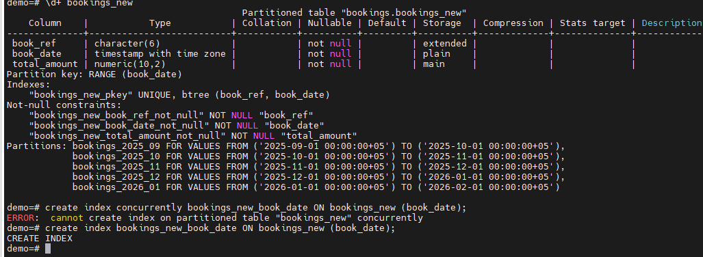
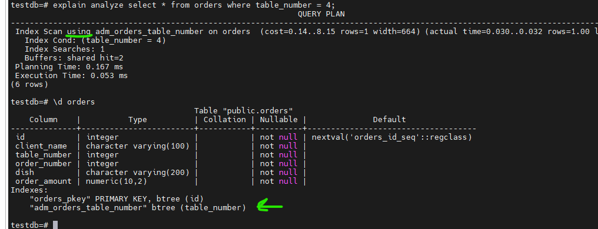
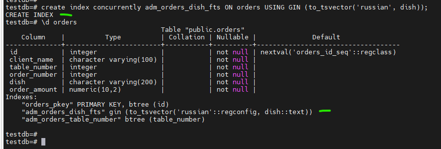
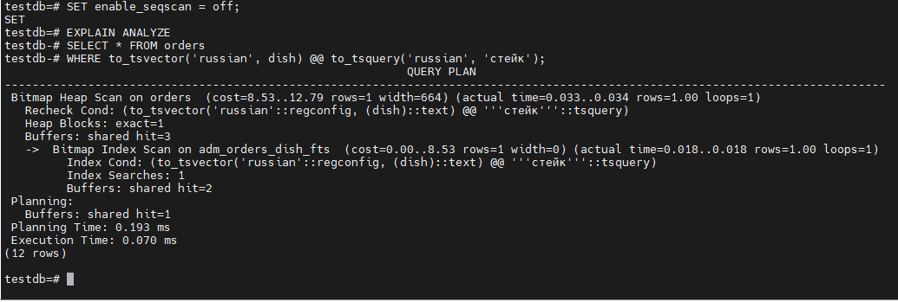
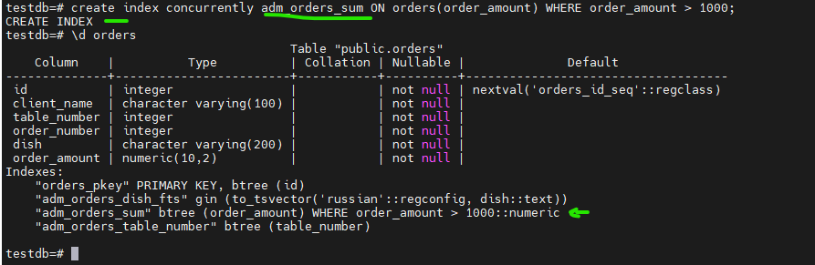
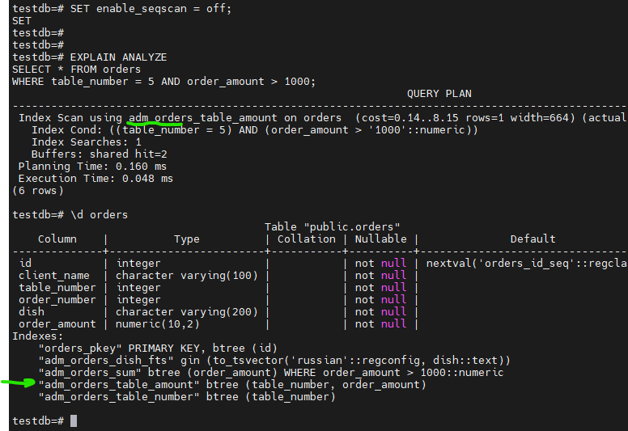
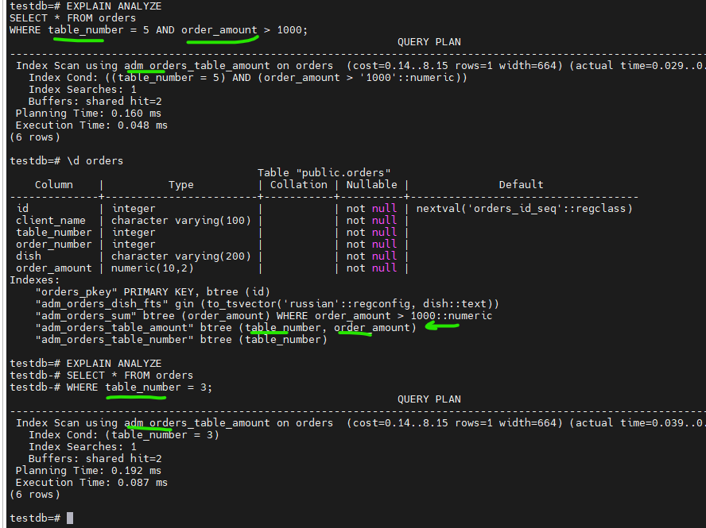
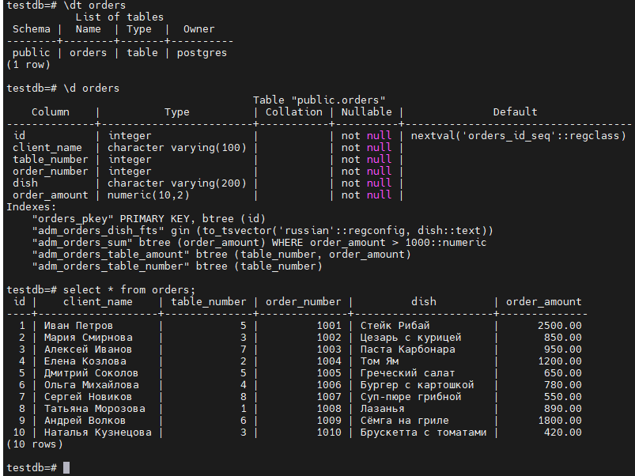

# Домашнее задание HW013

## Задание

### 1. Создать индекс к какой-либо из таблиц вашей БД
### 2. Прислать текстом результат команды explain,в которой используется данный индекс
### 3. Реализовать индекс для полнотекстового поиска
### 4. Реализовать индекс на часть таблицы или индекс на поле с функцией
### 5. Создать индекс на несколько полей
### 6. Написать комментарии к каждому из индексов
### 7. Описать что и как делали, с какими проблемами столкнулись

____________________________

# 1. Создать индекс к какой-либо из таблиц вашей БД

Команды:
- \c testdb
- \d orders
- create index concurrently adm_orders_table_number ON orders(table_number);
- \d orders

# 2. Прислать текстом результат команды explain,в которой используется данный индекс

Команды:

- \c testdb
- explain analyze select * from orders where table_number = 4;
- \d orders

# 3. Реализовать индекс для полнотекстового поиска

Команды:
-\d orders
- create index concurrently adm_orders_dish_fts ON orders USING GIN (to_tsvector('russian', dish));

# 4. Реализовать индекс на часть таблицы или индекс на поле с функцией

Команды:
- \d orders
-  SET enable_seqscan = off;
- create index concurrently adm_orders_sum ON orders(order_amount) WHERE order_amount > 1000;

# 5. Создать индекс на несколько полей

Команды:
- \d orders
- create index concurrently adm_orders_table_amount ON orders(table_number, order_amount);
- EXPLAIN ANALYZE SELECT * FROM orders WHERE table_number = 5 AND order_amount > 1000;
- explain ANALYZE SELECT * FROM orders WHERE table_number = 3;

# 6. Написать комментарии к каждому из индексов

#1. Создал простой индекс b-tree  на столбец  table_number для ускорения поиска заказов по номеру столика.  Все индексы делаю в режиме конкуренции, чтобы не было блокировки, (рабочая привычка)

#3. Создал индекс для полнотекстового поиска по названию блюда. (выше на скрине структура тествой таблицы в базе) Функция to_tsvector преобразует текст учитывая русские символы.

#4. Создан частичный индекс, который включет только запись с суммой заказа больше 1000 

#5 Создал составной индекс по двум колонкам table_number и order_amount

# 7. Описать что и как делали, с какими проблемами столкнулись

Проблем не было, регулярно в работе использую создание индексов. Предварительно проверяем функционал на тестовом контуре, позже согласовываем внедрение на продуктивный хост.
