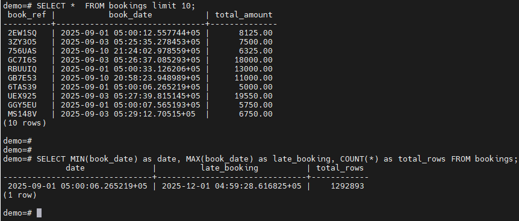
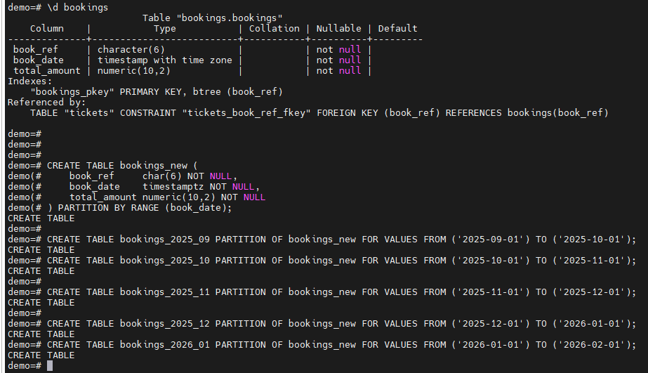
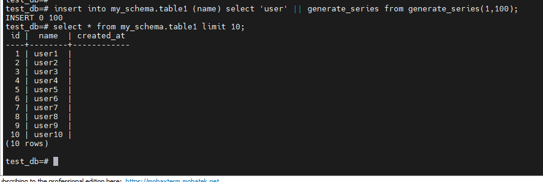
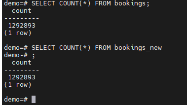
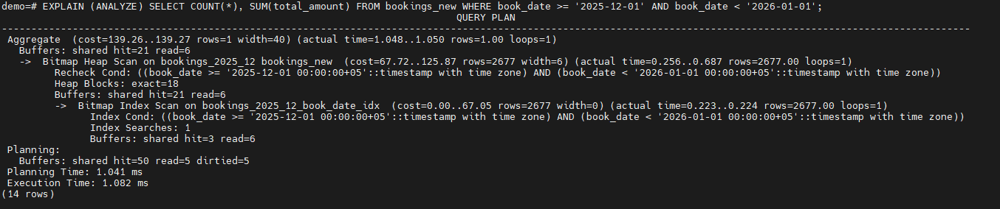
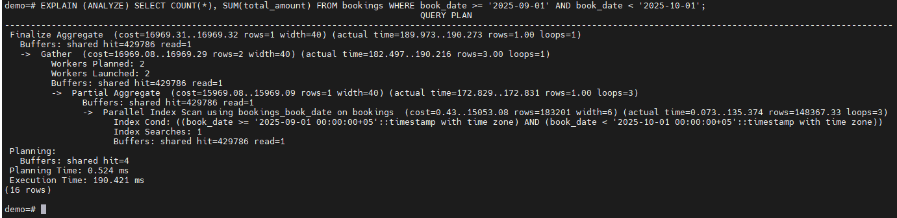

# Домашнее задание HW015

## Задание

Описание/Пошаговая инструкция выполнения домашнего задания:

### 1. На основе готовой базы данных примените один из методов секционирования в зависимости от структуры данных.
https://postgrespro.ru/education/demodb

Шаги выполнения домашнего задания:

### 2. Анализ структуры данных:

Ознакомьтесь с таблицами базы данных, особенно с таблицами bookings, tickets, ticket_flights, flights, boarding_passes, seats, airports, aircrafts.
Определите, какие данные в таблице bookings или других таблицах имеют логическую привязку к диапазонам, по которым можно провести секционирование (например, дата бронирования, рейсы).

Выбор таблицы для секционирования:
Основной акцент делается на секционировании таблицы bookings. Но вы можете выбрать и другие таблицы, если видите в этом смысл для оптимизации производительности (например, flights, boarding_passes).
Обоснуйте свой выбор: почему именно эта таблица требует секционирования? Какой тип данных является ключевым для секционирования?

### 3. Определение типа секционирования:
Определитесь с типом секционирования, которое наилучшим образом подходит для ваших данных:

По диапазону (например, по дате бронирования или дате рейса).

### 4. Создание секционированной таблицы:
Преобразуйте таблицу в секционированную с выбранным типом секционирования.
Например, если вы выбрали секционирование по диапазону дат бронирования, создайте секции по месяцам или годам.

### 5. Миграция данных:

Перенесите существующие данные из исходной таблицы в секционированную структуру.
Убедитесь, что все данные правильно распределены по секциям.

### 6. Оптимизация запросов:

Проверьте, как секционирование влияет на производительность запросов. Выполните несколько выборок данных до и после секционирования для оценки времени выполнения.
Оптимизируйте запросы при необходимости (например, добавьте индексы на ключевые столбцы).

### 7. Тестирование решения:
Протестируйте секционирование, выполняя несколько запросов к секционированной таблице.
Проверьте, что операции вставки, обновления и удаления работают корректно.

### 8. Документирование:

Добавьте комментарии к коду, поясняющие выбранный тип секционирования и шаги его реализации.
Опишите, как секционирование улучшает производительность запросов и как оно может быть полезно в реальных условиях.

Формат сдачи:

SQL-скрипты с реализованным секционированием.
Краткий отчет с описанием процесса и результатами тестирования.
Пример запросов и результаты до и после секционирования.

Критерии оценки:
Корректность секционирования – таблица должна быть разделена логично и эффективно.
Выбор типа секционирования – обоснование выбранного типа (например, секционирование по диапазону дат рейсов или по месту отправления/прибытия).
Работоспособность решения – код должен успешно выполнять секционирование без ошибок.
Оптимизация запросов – после секционирования, запросы к таблице должны быть оптимизированы (например, быстрее выполняться для конкретных диапазонов).
Комментирование – код должен содержать поясняющие комментарии, объясняющие выбор секционирования и основные шаги.

____________________________

# 1. Скачал и развернул БД демо с сайта потсгрес про. https://postgrespro.ru/education/demodb

# 2. Выбор таблицы для секционирования:

Команды:
- \c demo
- \d bookings
- SELECT *  FROM bookings limit 10;
- SELECT MIN(book_date) as date, MAX(book_date) as late_booking, COUNT(*) as total_rows FROM bookings;

# 3.Определение типа секционирования.

При осмотре и анализе подошла таблица bookings та как она основная в которой там есть дата бронирования по колонке book_date

# 4. Создание секционированной таблицы: Преобразуйте таблицу в секционированную с выбранным типом секционирования.Например, если вы выбрали секционирование по диапазону дат бронирования, создайте секции по месяцам или годам.

Выбрана таблица При осмотре и анализе подошла таблица bookings та как она основная в которой там есть дата бронирования по колонке book_date.  Берём ддл таблицы и создаём таблицу с рейнджом по дате. Создал таблицу bookings_new

Команды:
-\d bookings
-CREATE TABLE bookings_new (book_ref char(6) NOT NULL, book_date timestamptz NOT NULL, total_amount numeric(10,2) NOT NULL) PARTITION BY RANGE (book_date);

Создание секций в новой таблице по месяцам.

Команды:

- CREATE TABLE bookings_2025_09 PARTITION OF bookings_new FOR VALUES FROM ('2025-09-01') TO ('2025-10-01');
- CREATE TABLE bookings_2025_10 PARTITION OF bookings_new FOR VALUES FROM ('2025-10-01') TO ('2025-11-01');
- CREATE TABLE bookings_2025_11 PARTITION OF bookings_new FOR VALUES FROM ('2025-11-01') TO ('2025-12-01');
- CREATE TABLE bookings_2025_12 PARTITION OF bookings_new FOR VALUES FROM ('2025-12-01') TO ('2026-01-01');
- CREATE TABLE bookings_2026_01 PARTITION OF bookings_new FOR VALUES FROM ('2026-01-01') TO ('2026-02-01');

# 5. Миграция данных. 

Команды:
-insert into bookings_new (book_ref, book_date, total_amount) select book_ref, book_date, total_amount from bookings;

Проверяем подсчёт строк на исходной таблице (bookings) и на новой табице (bookings_new)

Команды:
- SELECT COUNT(*) FROM bookings;
- SELECT COUNT(*) FROM bookings_new;

# 6. Оптимизация запросов:

Создание индексов на новой таблице как на исходнике

Команды:
-- Уникальный индекс ДОЛЖЕН включать book_date
CREATE UNIQUE INDEX bookings_new_pkey ON bookings_new (book_ref, book_date);

-- Индекс для даты
create index  bookings_new_book_date ON bookings_new (book_date);

Для эксперимента подходит такое создание индекса но на боевой таблице нет. Если таблица уже имеет большое количество данных. То индекс нужно создавать в режиме конкарентли на каждую партицию, иначе это будет блокировка таблицы.

Корректный вид будет таким
CREATE INDEX CONCURRENTLY idx_09_date ON bookings_2025_09 (book_date);
CREATE INDEX CONCURRENTLY idx_10_date ON bookings_2025_10 (book_date);
CREATE INDEX CONCURRENTLY idx_11_date ON bookings_2025_11 (book_date);
CREATE INDEX CONCURRENTLY idx_12_date ON bookings_2025_12 (book_date);

Если использовать на родительской таблице он создатся, но в режиме CONCURRENTLY на родительской создать не получится, создание упадёт в ошибку. Но на бою чтобы не саффектить на производительность потрбуется создание индекса на каждую партицию в конкуренции.

# 7. Тестирование решения:

Команды: Запрос по партиции по созданному индексу.
-EXPLAIN (ANALYZE) SELECT COUNT(*), SUM(total_amount) FROM bookings_new WHERE book_date >= '2025-09-01' AND book_date < '2025-10-01';

Команды: Сравниваем с исходной таблицей за тот же приод времени
EXPLAIN (ANALYZE) SELECT COUNT(*), SUM(total_amount) FROM bookings WHERE book_date >= '2025-09-01' AND book_date < '2025-10-01';

# 8. Документирование:

Добавьте комментарии к коду, поясняющие выбранный тип секционирования и шаги его реализации.
Опишите, как секционирование улучшает производительность запросов и как оно может быть полезно в реальных условиях.

Выбрал секционирование по дате, так как это поле уже есть и это на мой взгляд самое удобное деление.

Обычно на проде делим по карталам. Чтобы не плодить огромное коичество партиций. В данном случае сделал по месяцам, так как скачал базу не большого объёма в которой данных на три месяца. Для теста это удобный вариант.

Запросы по индексированному полю работают в секциях намного быстрее.  Прирост в производительности виден.
