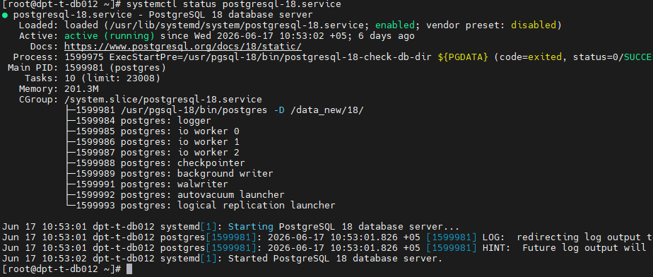
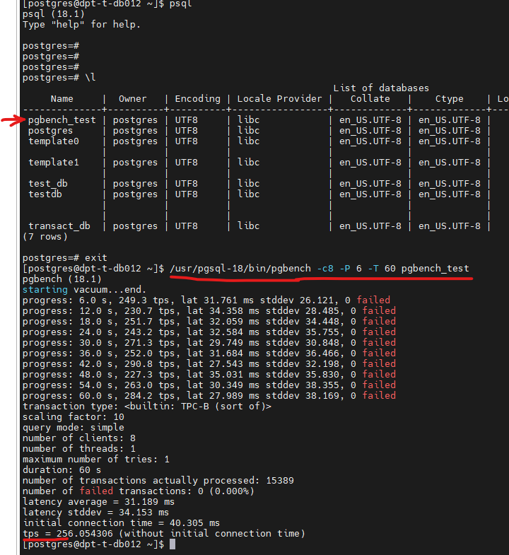
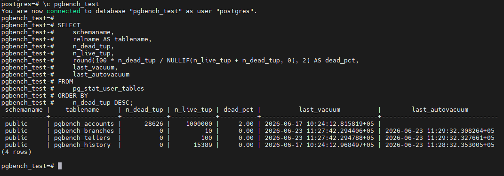
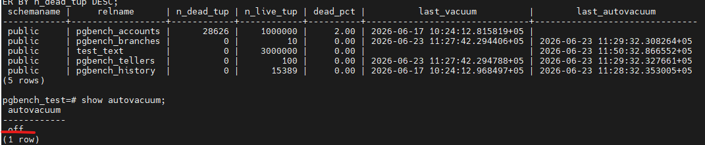
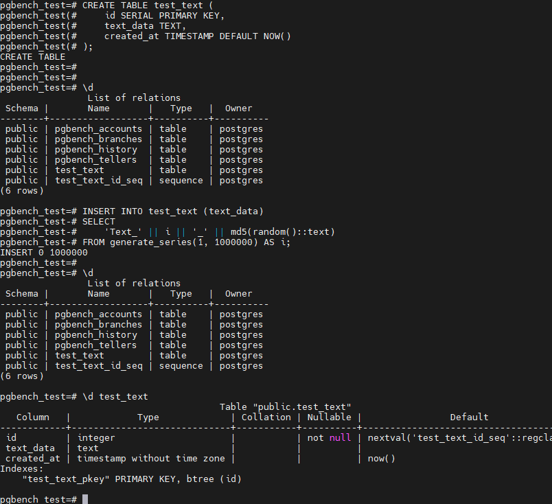
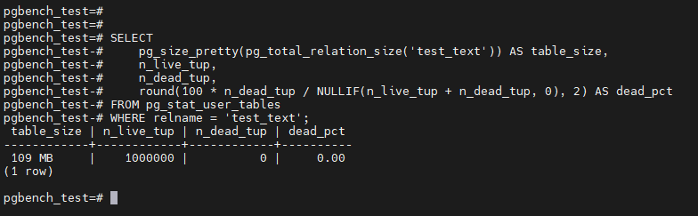
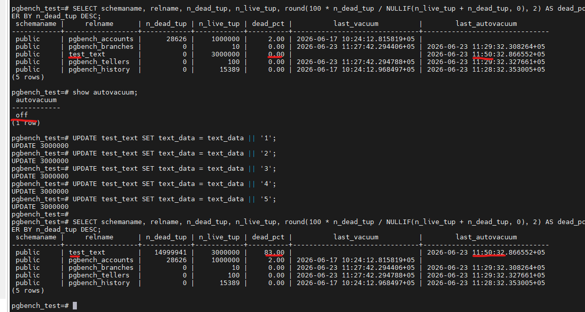
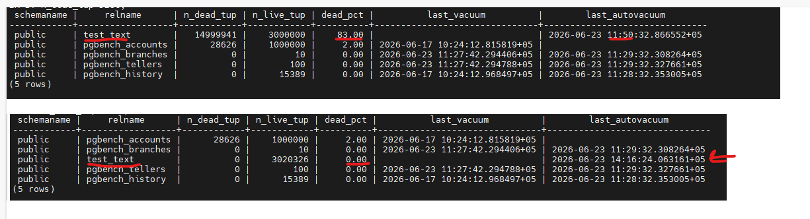
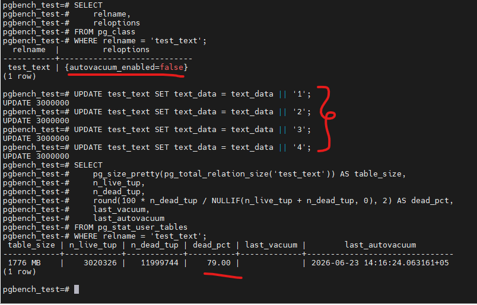
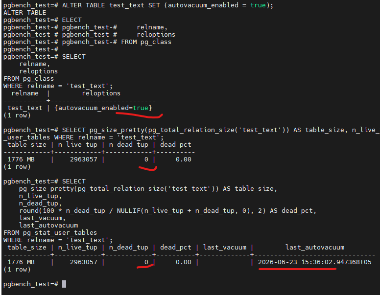

# Домашнее задание HW06

Задание:

### 1. Создайте ВМ (2 vCPU, 4 GB RAM, SSD 10 GB) и установите PostgreSQL 17 с дефолтными настройками;
### 2. Подготовьте тестовую базу pgbench (pgbench -i postgres) и выполните прогон нагрузки (pgbench -c8 -P 6 -T 60 -U postgres postgres);
### 3. Зафиксируйте состояние обслуживания после нагрузки: для пользовательских таблиц сохраните n_dead_tup, last_autovacuum, last_vacuum из pg_stat_user_tables;
### 4. Создайте таблицу с текстовым полем и заполните её 1 000 000 строк (допускается генерация через generate_series);
### 5. Зафиксируйте размер таблицы (например, pg_total_relation_size) и значение n_dead_tup;
### 6. Выполните 5 полных обновлений строк (добавление символа к текстовому полю), затем зафиксируйте n_dead_tup, last_autovacuum и размер таблицы;
### 7. Дождитесь срабатывания autovacuum (периодически проверяя last_autovacuum) и зафиксируйте изменения n_dead_tup/размера;
### 8. Отключите autovacuum только для этой таблицы, выполните 10 полных обновлений строк и снова зафиксируйте n_dead_tup и размер;
### 9. Объясните наблюдения: почему растёт размер и/или число «мёртвых» строк при отключённом обслуживании;
### 10. Включите autovacuum обратно для таблицы;

###############

# 1. Создайте ВМ (2 vCPU, 4 GB RAM, SSD 10 GB) и установите PostgreSQL 17 с дефолтными настройками;

# 2. Подготовьте тестовую базу pgbench (pgbench -i postgres) и выполните прогон нагрузки (pgbench -c8 -P 6 -T 60 -U postgres postgres);

Команды:
-/usr/pgsql-18/bin/pgbench -c8 -P 6 -T 60 pgbench_test

# 3. Зафиксируйте состояние обслуживания после нагрузки: для пользовательских таблиц сохраните n_dead_tup, last_autovacuum, last_vacuum из pg_stat_user_tables;

Команды:
-\c pgbench_test
-SELECT schemaname, relname, n_dead_tup, n_live_tup, round(100 * n_dead_tup / NULLIF(n_live_tup + n_dead_tup, 0), 2) AS dead_pct, last_vacuum, last_autovacuum FROM pg_stat_user_tables ORDER BY n_dead_tup DESC;

#. Кажется в этом шаге в пошаговую часть инструкции по домашнему заданию, нужно похоже доабвить пункт отключение автовакуума. У меня он сработал после апдейта..

# Отключил автовакуум сделал вставку из двух миллионов. 
По статистике остался последний мой автовакуум. Новый не отработал.

# 4. Создайте таблицу с текстовым полем и заполните её 1 000 000 строк (допускается генерация через generate_series);

Команды:
-\c pgbench_test
-CREATE TABLE test_text (id SERIAL PRIMARY KEY, text_data TEXT, сreated_at TIMESTAMP DEFAULT NOW());
-INSERT INTO test_text (text_data) SELECT 'Text_' || i || '_' || md5(random()::text) FROM generate_series(1, 1000000) AS i;
-\d test_text

# 5. Зафиксируйте размер таблицы (например, pg_total_relation_size) и значение n_dead_tup;

Команды:

- \c pgbench_test
-SELECT pg_size_pretty(pg_total_relation_size('test_text')) AS table_size, n_live_tup, n_dead_tup, round(100 * n_dead_tup / NULLIF(n_live_tup + n_dead_tup, 0), 2) AS dead_pct FROM pg_stat_user_tables WHERE relname = 'test_text';

# 6. Выполните 5 полных обновлений строк (добавление символа к текстовому полю), затем зафиксируйте n_dead_tup, last_autovacuum и размер таблицы;

Команды:
-UPDATE test_text SET text_data = text_data || '1';
-UPDATE test_text SET text_data = text_data || '2';
-UPDATE test_text SET text_data = text_data || '3';
-UPDATE test_text SET text_data = text_data || '4';
-UPDATE test_text SET text_data = text_data || '5';

# 7. Дождитесь срабатывания autovacuum (периодически проверяя last_autovacuum) и зафиксируйте изменения n_dead_tup/размера;

Спустя 3 минуты автовакумм отработал.

Приложу скрин в виде было и стало.

# 8. Отключите autovacuum только для этой таблицы, выполните 10 полных обновлений строк и снова зафиксируйте n_dead_tup и размер;

Команды:
-UPDATE test_text SET text_data = text_data || '1';
-UPDATE test_text SET text_data = text_data || '2';
-UPDATE test_text SET text_data = text_data || '3';

# 9. Объясните наблюдения: почему растёт размер и/или число «мёртвых» строк при отключённом обслуживании;

При выключенном автовакууме не выполняется фоновая очистка таблиц.
UPDATE / DELETE не удаляют данные физически — они помечают старые версии строк как "мёртвые" и новые версии записываются рядом, занимая дополнительное место на жиске. Без регулярного обслуживания эти "мёртвые" строки накапливаются бесконечно, и в последствии аффектят на производительность.

# 10. Включите autovacuum обратно для таблицы.

Команды:

-SELECT relname, reloptions FROM pg_class WHERE relname = 'test_text';
-ALTER TABLE test_text SET (autovacuum_enabled = true);
-

