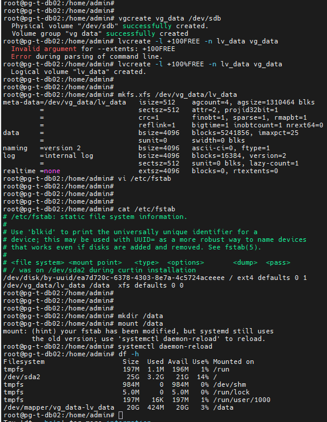
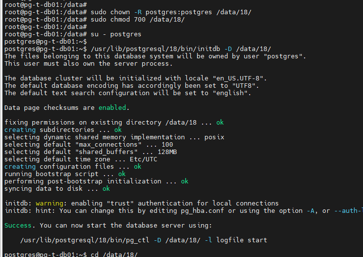
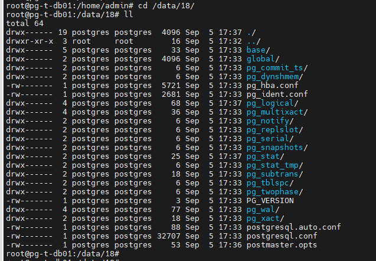
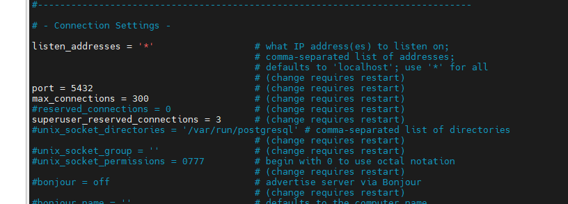
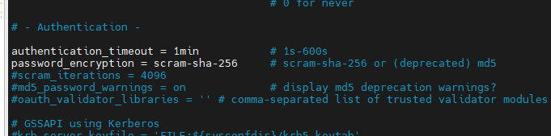
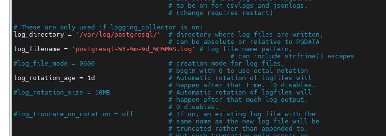
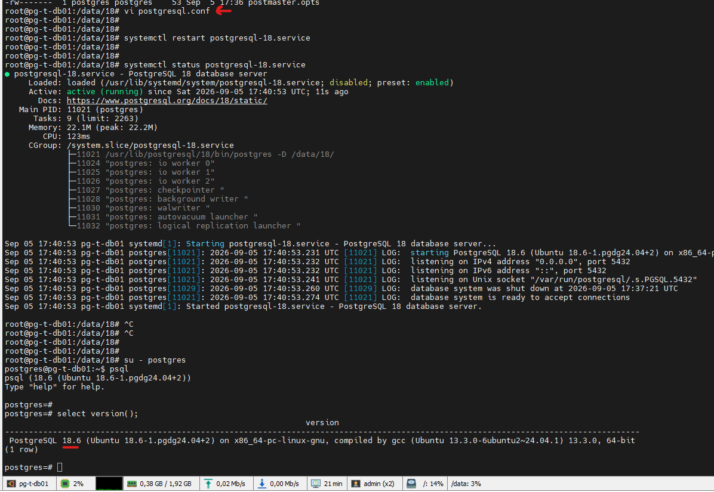

###Подготовка серверов

##За основу взял платформу virtualbox

###Порядок действий:

#1. Скачиваем и устанавливаем VurtualBox
- Ресурс:
https://www.virtualbox.org/wiki/Downloads

#2. Создаём виртуальные машины:

![Скриншот 2] (virtualbox_hosts.png)

#3.Скачаваем дистрибутив Ubuntu

- Ресурс:
https://ubuntu.com/download/server

#4. Подготовительные настройки перед работами.

Настройка сети:
В файле /etc/netplan Конфигурим ямл файл.

- Команды:
- sudo vi /etc/netplan/50-cloud-init.yaml
-Прописываем параметры и применяем план по команде netplan apply

#5. Обновление и установка дополнительного ПО.

- Команды:
-sudo apt update
-sudo apt upgrade
-sudo apt install openssh-server -y
-sudo systemctl start ssh.service
-sudo systemctl enable ssh.service
-sudo systemctl status ssh.service

#6. Скачиваем и устанавливаем внешнего клиента для удобства работы Moba Extern (Или любой дрйгоу клиент по желанию)

-Ресурсы
https://mobaxterm.mobatek.net/download.html

Инсталиируем или запускаем портейбл версию.

#7. Подготовка SSH ключа и проброс:

- Команды:
-ssh-keygen
-C:\Users\AMAYA/.ssh/id_ed25519
Пробрасваем ключ через Power Shell
-type C:\Users\AMAYA\.ssh\id_rsa.pub | ssh admin@192.168.0.104 "cat >> ~/.ssh/authorized_keys"

#8. Подготовка и разметка дисков для базы данных.

- Команды
- vgcreate vg_data /dev/sde 
- lvcreate -l +100%FREE -nlv_data vg_data 
- mkfs.xfs /dev/vg_data/lv_data
- vi/etc/fstab
- mkdir /data
- mount /data

### Установка PostgreSQL

# 1. Установка PostgreSQL и выдача прав на каталоги. Инициализация
- Команды
- sudo apt install -y postgresql-common
- sudo /usr/share/postgresql-common/pgdg/apt.postgresql.org.sh
- sudo apt update
- /usr/lib/postgresql/18/bin/initdb -D /data/18/
- sudo chown -R postgres:postgres /data/18/
- sudo chmod 700 /data/18/ 

# 2. Идём в каталог для предварительной настройки основного конфигурационного файла postgresql.conf

# 3. Предварительная настройка postgresql.conf

# 3. Создаём сервис

Команды:
- vi /usr/lib/systemd/system/postgresql-18.service

Наполняем сервис:
- [Unit]
- Description=PostgreSQL 18 database server
- Documentation=https://www.postgresql.org/docs/18/static/
- After=syslog.target
- After=network-online.target

- [Service]
- Type=notify

- User=postgres
- Group=postgres

- # Note: avoid inserting whitespace in these Environment= lines, or you may
- # break postgresql-setup.

- # Location of database directory
- Environment=PGDATA=/data_new/18/

- # Where to send early-startup messages from the server (before the logging
- # options of postgresql.conf take effect)
- # This is normally controlled by the global default set by systemd
- # StandardOutput=syslog

- # Disable OOM kill on postgres main process
- OOMScoreAdjust=-1000
- Environment=PG_OOM_ADJUST_FILE=/proc/self/oom_score_adj
- Environment=PG_OOM_ADJUST_VALUE=0

- ExecStart=/usr/pgsql-18/bin/postgres -D ${PGDATA}
- ExecReload=/bin/kill -HUP $MAINPID
- KillMode=mixed
- KillSignal=SIGINT

- # Do not set any timeout value, so that systemd will not kill postgres
- # main process during crash recovery.
- TimeoutSec=infinity

- TimeoutStartSec=infinity
- TimeoutStopSec=1h

- [Install]
- WantedBy=multi-user.target

# 4. Запускаем сервис 

 

