### Установка Patroni
 
# 1. Скачиваем необходимые пакеты для установки:

- https://github.com/patroni/patroni/tree/master/patroni
- https://apt.postgresql.org/pub/repos/apt/pool/main/p/patroni/

# Пакет	                Где искать
- python3-prettytable	http://archive.ubuntu.com/ubuntu/pool/main/p/prettytable/
- python3-psutil	        http://archive.ubuntu.com/ubuntu/pool/main/p/python-psutil/
- python3-dnspython	http://archive.ubuntu.com/ubuntu/pool/main/d/dnspython/
- python3-kazoo	
- python3-cdiff	        http://archive.ubuntu.com/ubuntu/pool/universe/c/cdiff/
- python3-psycopg2	https://apt.postgresql.org/pub/repos/apt/pool/main/p/psycopg2/

# Копируем пакеты:
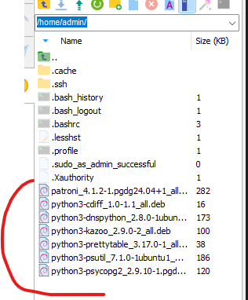

# Установка

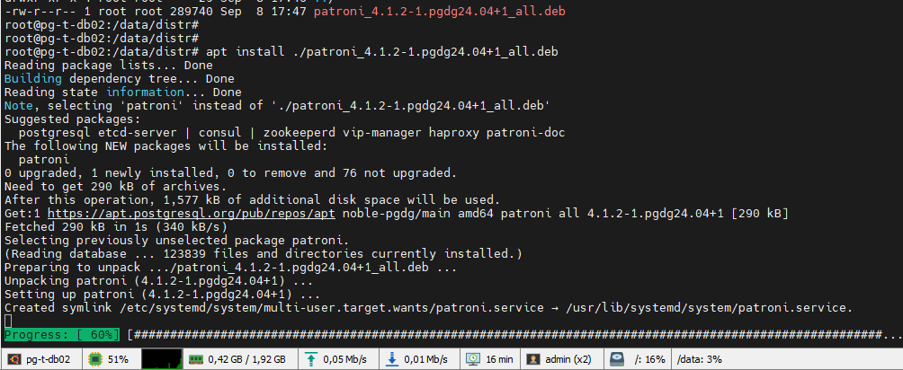

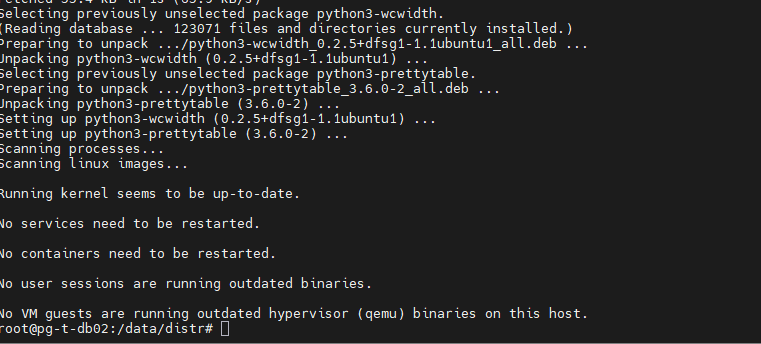

# Проверяем, что версия установилась.

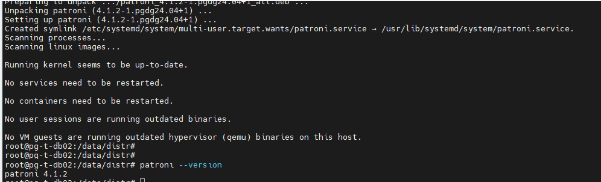

# 2.Выдаём гранты и создаём yml файл:

# Гранты на папку

- chown -R postgres:postgres /etc/patroni
- chmod 750 /etc/patroni

# Гранты на конфиг файл.
- touch patroni.yml
- chmod 640 /etc/patroni/patroni.yml

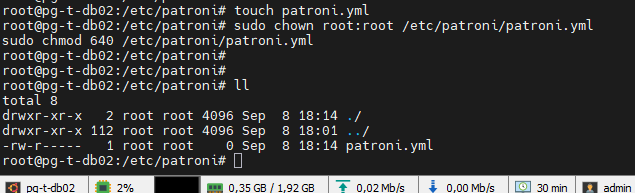

# 3. Наполняем patroni.yml (на основе файла образца config.yml.in это файл шаблон с пустыми параметрами) 

# Наполнение файла:

- name: pg_t-db01
- scope: project_cluster
- namespace: /db/

- zookeeper:
 -  hosts:
    - 192.168.0.110
    - 192.168.0.102
    - 192.168.0.112

- restapi:
  - listen: 0.0.0.0:8008
  - connect_address: 192.168.0.104:8008
  - authentication:
  - username: patroni
  - password: 1qaz@WSX

- bootstrap:
-  dcs:
   - ttl: 90
   - loop_wait: 10
   - retry_timeout: 30
   - maximum_lag_on_failover: 102400
   - master_start_timeout: 90
   - synchronous_mode: false
   - synchronous_mode_strict: false
  - postgresql:
  -    use_pg_rewind: true
  -    use_slots: true
  -    parameters:
  -    listen_addresses: '*'
  -     max_connections: 300
  -     max_locks_per_transaction: 128
  -     max_pred_locks_per_transaction: 128
  -     port: 5432
  -     superuser_reserved_connections: 3
  -     unix_socket_directories: '/var/run/postgresql'
  -     authentication_timeout: 45s
  -     password_encryption: scram-sha-256
  -     shared_buffers: 128MB
  -     huge_pages: try
  -     temp_buffers: 32MB
  -     work_mem: 8MB
  -     hash_mem_multiplier: 4.0
  -     maintenance_work_mem: 1024MB
  -     autovacuum_work_mem: 512MB
  -     vacuum_cost_limit: 1000
  -     bgwriter_delay: 20ms
  -     bgwriter_lru_maxpages: 800
  -     bgwriter_lru_multiplier: 3.0
  -     effective_io_concurrency: 300
  -     max_parallel_workers_per_gather: 2
  -     max_parallel_maintenance_workers: 2
  -     wal_level: replica
  -     fsync: on
  -     synchronous_commit: on
  -     full_page_writes: on
  -     wal_log_hints: on
  -     wal_compression: on
  -     wal_recycle: on
  -     wal_buffers: 16MB
  -     checkpoint_timeout: 120min
  -     checkpoint_completion_target: 0.8
  -     max_wal_size: 8GB
  -     min_wal_size: 2GB
  -     archive_mode: off
  -     wal_keep_size: 256MB
  -     max_wal_senders: 10
  -     hot_standby: on
  -     default_statistics_target: 200
  -     log_destination: 'stderr'
  -     logging_collector: on
  -     log_directory: '/var/log/postgresql'
  -     log_filename: 'postgresql-%d-%m-%Y.log'
  -     log_file_mode: 0600
  -     log_rotation_age: 1d
  -     log_min_messages: notice
  -     log_min_error_statement: warning
  -     log_min_duration_statement: 2000
  -     log_autovacuum_min_duration: 10min
  -     log_checkpoints: off
  -     log_line_prefix: '%m [%p]: user=%u, db=%d, app=%a, client=%h, session=%c '
  -     log_lock_waits: on
  -     log_statement: 'ddl'
  -     autovacuum: on
  -     autovacuum_max_workers: 1
  -     autovacuum_naptime: 3s
  -     autovacuum_vacuum_threshold: 0
  -     autovacuum_analyze_threshold: 0
  -     autovacuum_vacuum_scale_factor: 0.04
  -     autovacuum_vacuum_insert_scale_factor: 0.04
  -     autovacuum_analyze_scale_factor: 0.02
  -     autovacuum_freeze_max_age: 400000000
  -     autovacuum_multixact_freeze_max_age: 800000000
  -     autovacuum_vacuum_cost_limit: 1000
  -     autovacuum_freeze_max_age: 400000000
  -     autovacuum_multixact_freeze_max_age: 800000000
  -     max_locks_per_transaction: 128
  -     max_pred_locks_per_transaction: 128
  -   initdb:
    - encoding: UTF8
    - data-checksums
    - auth-host: scram-sha-256
    - auth-local: trust
- postgresql:
  -listen: 0.0.0.0:5432
  - connect_address: 192.168.0.104:5432
  - config_dir: /data/18/
  - data_dir: /data/18/
  - bin_dir: /usr/lib/postgresql/18/bin
  - pgpass: /var/lib/postgresql/.pgpass
  - authentication:
  - superuser:
    -  username: postgres
    -  password: 1qaz@WSX
   - pg_rewind:
   -   username: postgres
   -   password: 1qaz@WSX
  -  replication:
  -    username: repl
  -    password: P@ssw0rd
 - create_replica_methods:
 -   basebackup:
    -  checkpoint: 'fast'
 - callbacks:
 -  parameters:

- watchdog:
-  mode: off # Allowed values: off, automatic, required
-  device: /dev/watchdog
-  safety_margin: 5

- tags:
 - nofailover: false
 - noloadbalance: false
 - clonefrom: false
 - nosync: false
                      
# 4. На серверах баз данных останавливаем PostgreSQL. Проверяем статус службы, должен быть inactive .  Так как основное управление переходит к Patroni.

- Команды:
- systemctl stop postgresql-18.service
- systemctl status postgresql-18.service

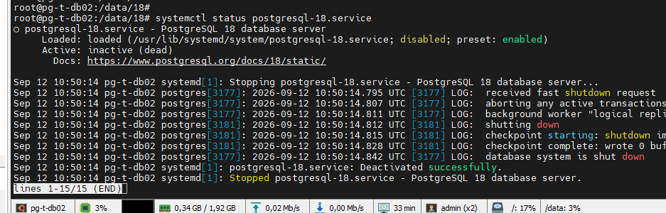

# 5. Запускаем одну ноду кластера. (Чтобы нода стала лидером.)

- Команды
- Создаём символьную ссылку для удобства набора команды patronictl  - ln -s /etc/patroni/patroni.yml /root/ .config/patroni/patronictl.yaml
- systemctl start patroni.service
- systemctl status patroni.service
- patronictl list

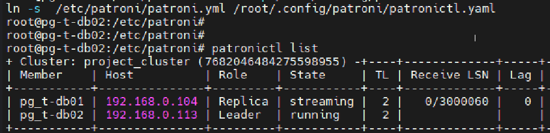

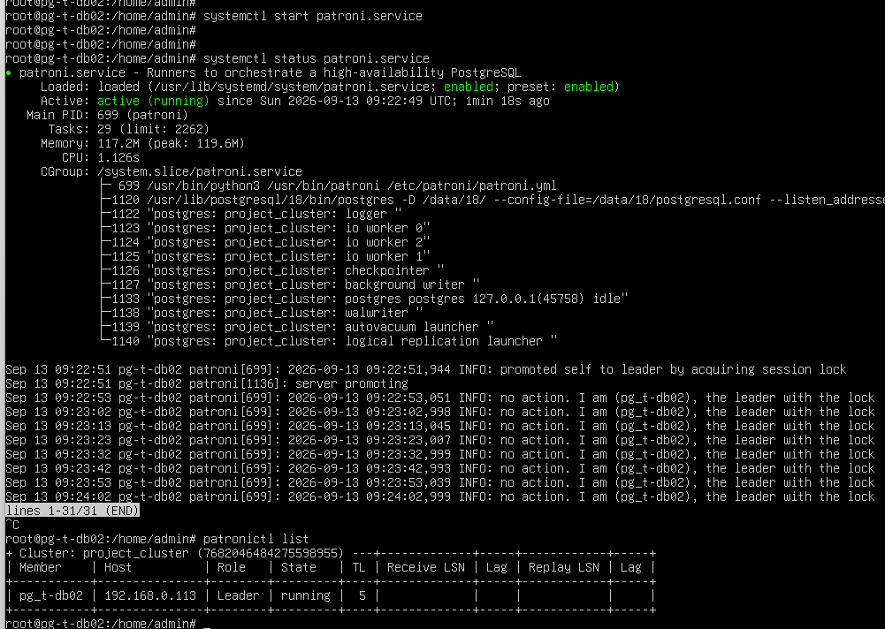

# 6. Запускаем вторую ноду кластера и проверяем статус, делаем проверочные манипуляции (рестарт, релоад, переключение лидера)

- patronictl list

- patronictl reload

- patronictl restart

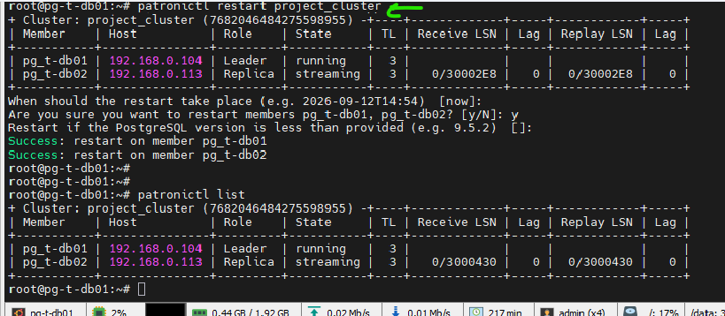

# 7. Меняем параметры в основном конфиге.

- Команды:
- patronictl edit-config
-  

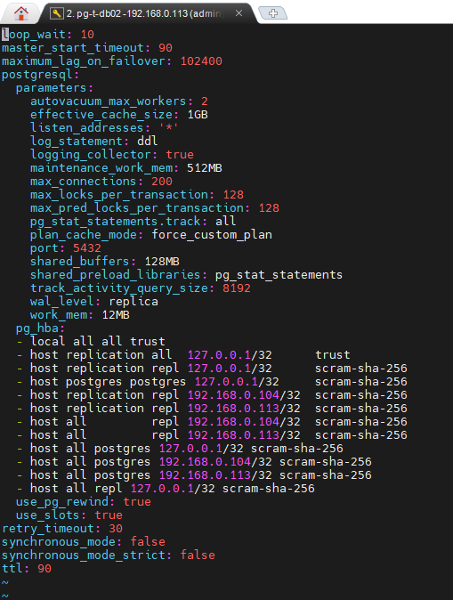

# Меняем параметры

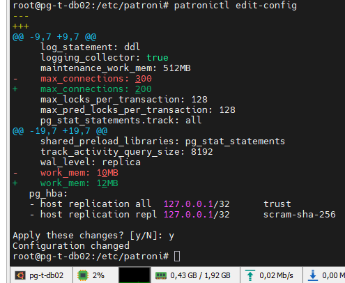

- проверяем статус кластера что требуется рестарт перечитанного конфига для применения параметров.

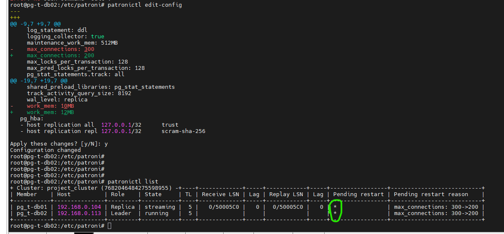

- выполняем рестарт кластера для применения параметров. Кластер ожидает рестарт параметров.
- patronictl restart project_cluster

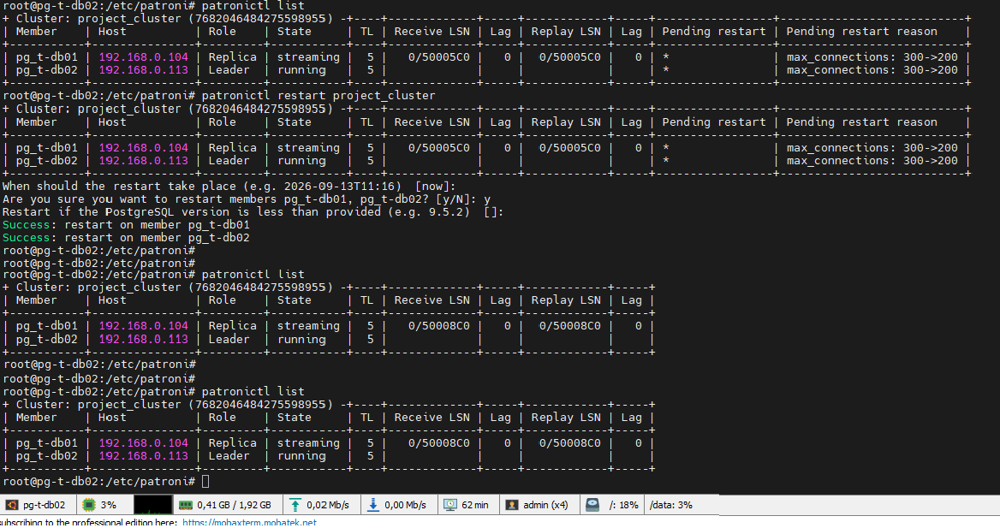

- Проверяем, что Patroni корректно управляет hba конфигом.

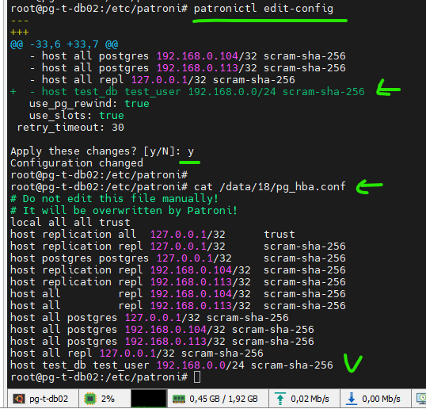

# 8. Проверка переключения кластера:

- Команды: 
- patronictl switchover

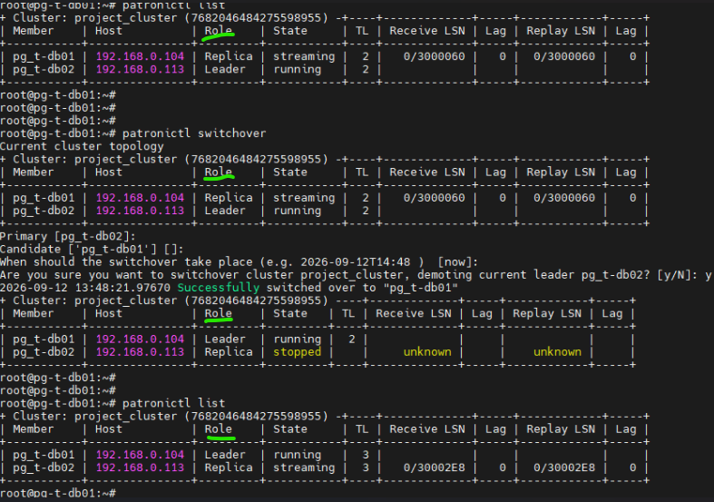

- Проверяем аварийное переключение кластера (просто отправляем хост в перезагрузку)

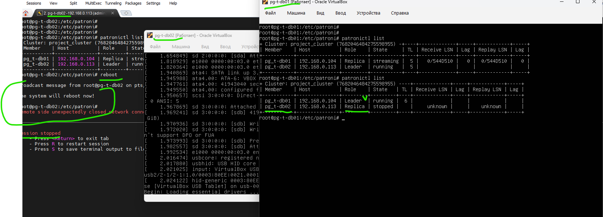

# 9. Команды управления кластером:

- Команды  (если не использовать символьную ссылку их пункта № 5.  ln -s /etc/patroni/patroni.yml /root/ .config/patroni/patronictl.yaml) То команда будет выглядеть более грамоздко patronictl -c /etc/patroni/patroni.yml list

- patronictl list - покажет список всех узлов кластера, их роли и состояние. (статус кластера)

- patronictl show-config - покажет текущую динамическую конфигурацию кластера.

- patronictl edit-config - откроет динамическую конфигурацию кластера в редакторе для правки. (сюда добавляются pg_hba и другие параметры)

- patronictl switchover - выполнит плановое переключение роли Leader на выбранную реплику. (для обслуживания или миграции)

- patronictl failover - принудительно переключит роль Leader на реплику, даже если текущий лидер недоступен. (аварийное переключение)

- patronictl restart <cluster_name> [member_name] - перезапустит PostgreSQL на указанных узлах. (нужен для применения параметров, требующих рестарта: max_connections, shared_buffers и т.д.)

- patronictl reload <cluster_name> [member_name] - перечитает конфигурацию и применит параметры, которые можно изменить "на лету", не разрывая соединения.

- patronictl reinit <cluster_name> <member_name> - полностью пересоздаст данные на реплике (удалит и заново сделает basebackup). (осторожно: все данные на узле будут удалены!)

- patronictl pause - отключит автоматический failover. (режим обслуживания, когда Patroni не выполняет автоматические действия)

- patronictl resume - включит автоматический failover обратно.

- patronictl history - покажет историю всех переключений (failover/switchover) с указанием времени, timeline и нового лидера.

# 10. Проверка, что можем подключится к psql

- Команды:
- su - postgres
- psql
- Пробуем создать базы или пользователя create database test_db;

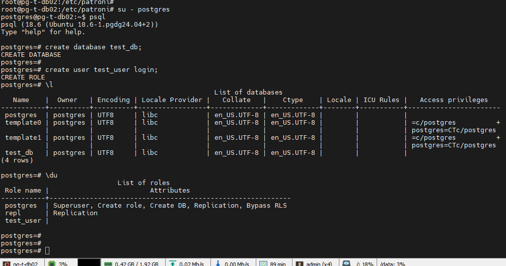

# 11. Проверяем внешее подклюение через IDE PgAdmin

- Дистрибутив взять из ресурса  https://www.pgadmin.org/download/pgadmin-4-windows/

- регистрируем подключения и добавляем хост

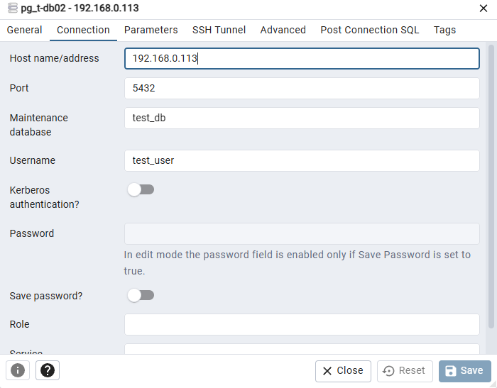

- Прверяем, что подключение прошло успешно.

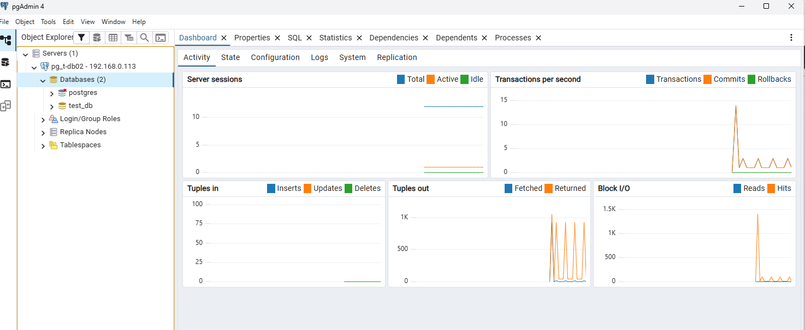

