# Подготовительные работы по разворавичиванию кластера zookeeper

##За основу взял платформу virtualbox

###Порядок действий:

#1. Скачиваем и устанавливаем VurtualBox
- Ресурс:
https://www.virtualbox.org/wiki/Downloads

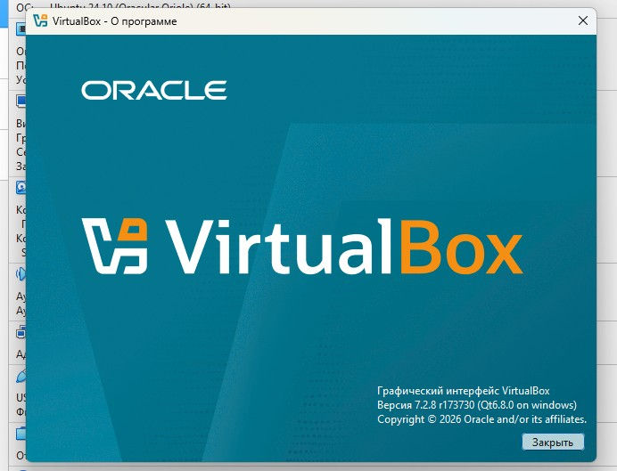

#2. Создаём виртуальные машины:

![Скриншот 2] (virtualbox_hosts.png)

#3.Скачаваем дистрибутив Ubuntu

- Ресурс:
https://ubuntu.com/download/server

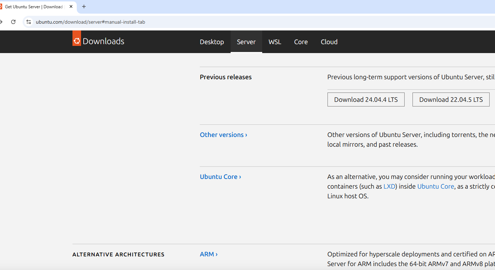

#4. Подготовительные настройки перед работами.

Настройка сети:
В файле /etc/netplanКонфигурим ямл файл.

- Команды:
- sudo vi /etc/netplan/50-cloud-init.yaml
-Прописываем параметры и применяем план по команде netplan apply

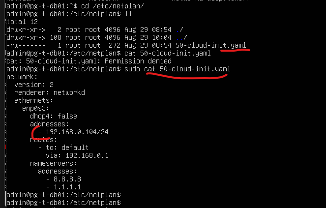

#5. Обновление и установка дополнительного ПО.

- Команды:
-sudo apt update
-sudo apt upgrade
-sudo apt install openssh-server -y
-sudo systemctl start ssh.service
-sudo systemctl enable ssh.service
-sudo systemctl status ssh.service

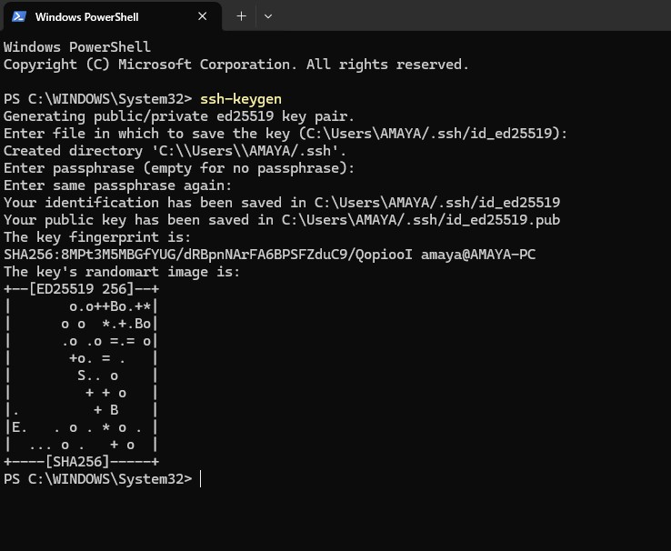

#6. Скачиваем и устанавливаем внешнего клиента для удобства работы Moba Extern (Или любой дрйгоу клиент по желанию)

-Ресурсы
https://mobaxterm.mobatek.net/download.html

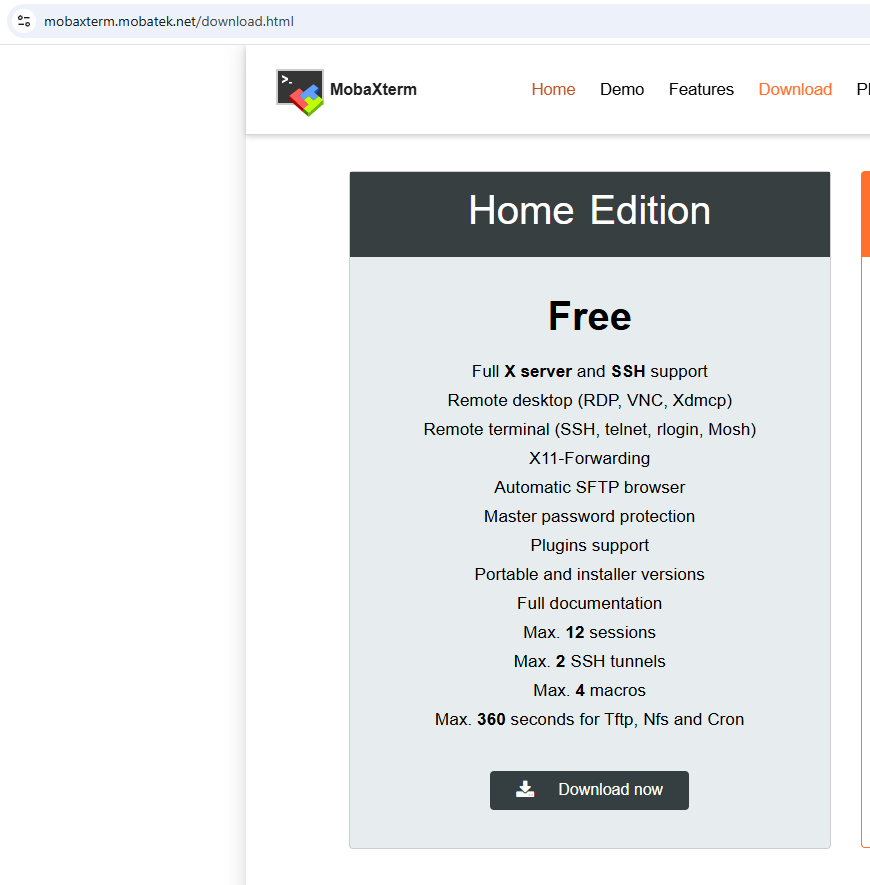

Инсталиируем или запускаем портейбл версию.

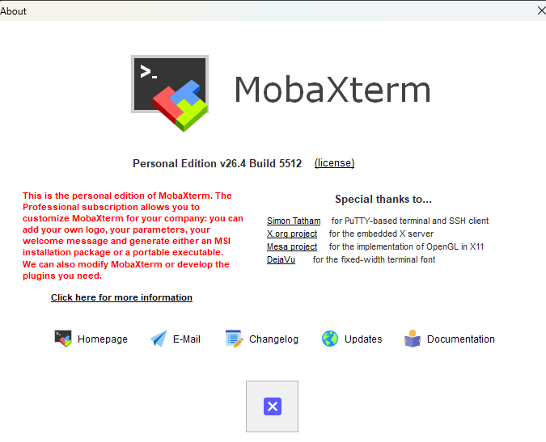

#7.Подготовка SSH ключа и проброс:

- Команды:
-ssh-keygen
-C:\Users\AMAYA/.ssh/id_ed25519
Пробрасваем ключ через Power Shell
-type C:\Users\AMAYA\.ssh\id_rsa.pub | ssh admin@192.168.0.104 "cat >> ~/.ssh/authorized_keys"

### Установка Zookeeper

#1. Установка необходимых компонентов и пакетов
-Ресурсы:
https://zookeeper.apache.org/releases

- Скачиваем дистрибутив 
apache-zookeeper-3.9.5-bin.tar.gz

Потребуется установить пакет java  так как zookeeper работает на пакетах java  и просто не запустится.

- Команды
sudo apt install default-jre certificates netcat-openbsd

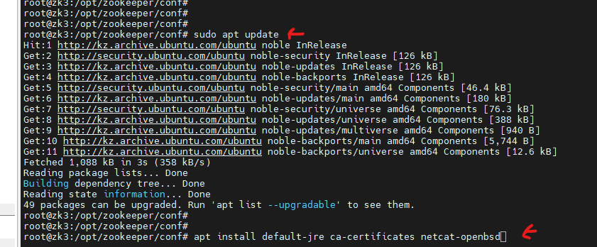

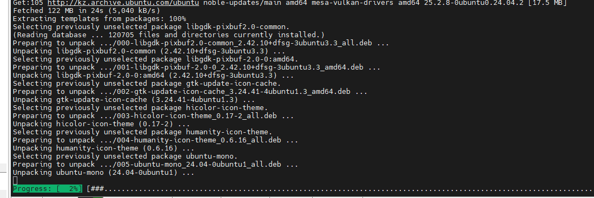

Разархивируем дистрибутив :

Команда:
-tar -xzf apache-zookeeper-3.9.5-bin.tar.gz -C /opt/zookeeper/ --strip-components=1

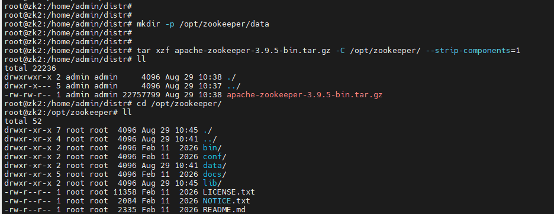

Проверяем установку пакетов Java
-Команды 
-java --version

java_version.png

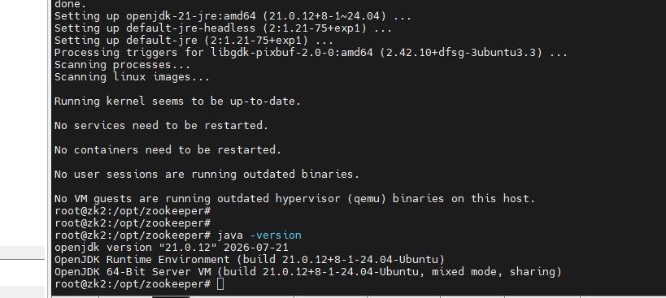

#2. Необходимые права и каталоги

/opt/zookeeper  /var/log/zookeeper  /opt/zookeeper/data

zoo.cfg

- Команды
-mkdir -p /opt/zookeeper  /var/log/zookeeper  /opt/zookeeper/data
-chown -R zookeeper:zookeeper  /opt/zookeeper  /var/log/zookeeper

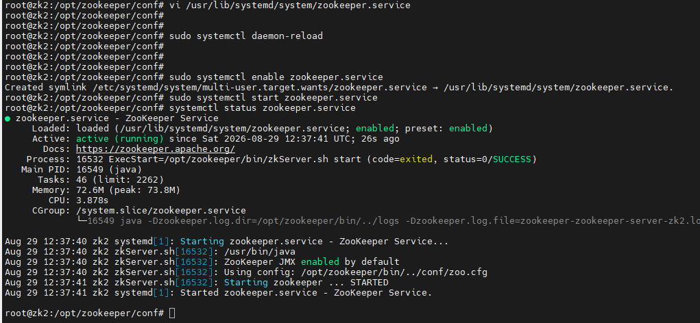

Команды:
- touch /opt/zookeeper/conf/zoo.cfg
- useradd -r c 'zookeeper service' zookeeper
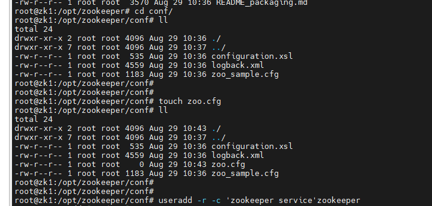

#3. Настройка конфигов
- Команды
В созданный файл конфига добавляем параметры ниже
vi /opt/zookeeper/conf/zoo.cfg

tickTime = 2000
maxSessionTimeout = 50000
syncLimit = 5
initLimit = 300
autopurge.purgeInterval = 1
autopurge.snapRetainCount = 5
snapCount = 200000
clientPort = 2181
maxClientCnxns = 500
4lw.commands.whitelist = stat
dataDir = /opt/zookeeper/data
dataLogDir = /var/log/zookeeper
dynamicConfigFile = /opt/zookeeper/conf/zoo.cfg.dynamic
#metricsProvider.className=org.apache.zookeeper.metrics.prometheus.PrometheusMetricsProvider
#metricsProvider.httpHost=0.0.0.0
#metricsProvider.httpPort=7000
#metricsProvider.exportJvmInfo=true

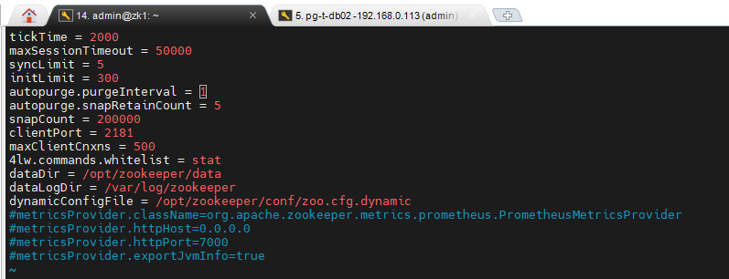 

Описание: 
tickTime — длина тика в миллисекундах. 
Тик является базовой единицей времени в Zookeeper, относительно которого ведутся другие расчеты.
maxSessionTimeout — время в миллисекундах, отведенное для взаимодействия сервера с клиентом.
syncLimit — время в тиках, в течение которого подключенные клиенты должны синхронизировать данные. При превышении этого времени, клиент будет отброшен.
initLimit — количество времени в тиках, которое отведено на подключение к серверу и выполнение синхронизации с ним.
autopurge.purgeInterval — указываем интервал в часах для автоматической чистки.
autopurge.snapRetainCount — количество последних снимков, которые нужно сохранить при выполнении автоматической чистки.
snapCount — количество записей в журнале транзакций, после которого будет запущен снимок с обнулением журнала.
clientPort — порт, на котором наше приложение будет слушать запросы клиентов.
maxClientCnxns — число одновременных соединений, которое может сделать клиент.
4lw.commands.whitelist — список разрешенных команд через запятую. Данные команды можно будет отправить через telnet. В данном примере это команда для отображения статуса работы приложения.
dataDir — путь для хранения снимков журналов базы данных.
dataLogDir — путь, по которому zookeeper будет хранить журналы транзакций. Если не указан, то храниться будет в dataDir.

#4. Настройка сервисов
- Команды
-vi /usr/lib/systemd/system/zookeeper.service

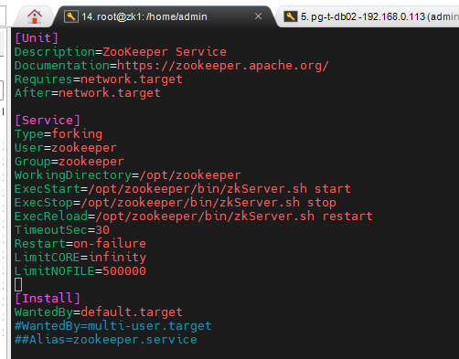

#5. Запускаем сервис и проверяем статус

- Команды
sudo systemctl daemon-reload
sudo systemctl status zookeeper
sudo systemctl enable zookeeper.service
sudo systemctl start zookeeper.service
sudo systemctl status zookeeper

#6. Проверка статуса кластера и количество серверов в кластере:

Статус сервера в кластере проверка через команду:
-/opt/zookeeper/bin/zkServer.sh status

Проверка запросом-командой
- for h in 192.168.0.110 192.168.0.102 192.168.0.112; do echo -n "$h: "; echo stat | nc $h 2181 2>/dev/null | grep Mode || echo "unreachable"; done

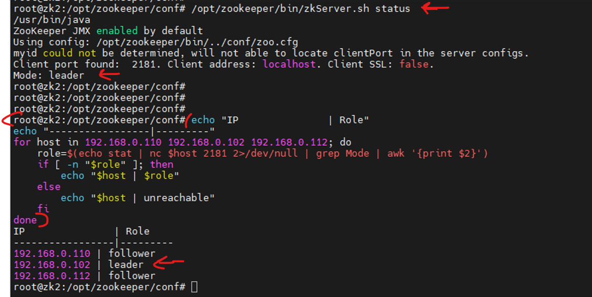

#7. Проверка переключения

- Команды

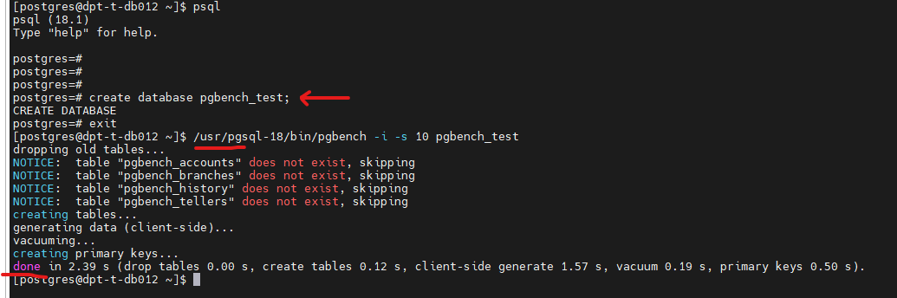

