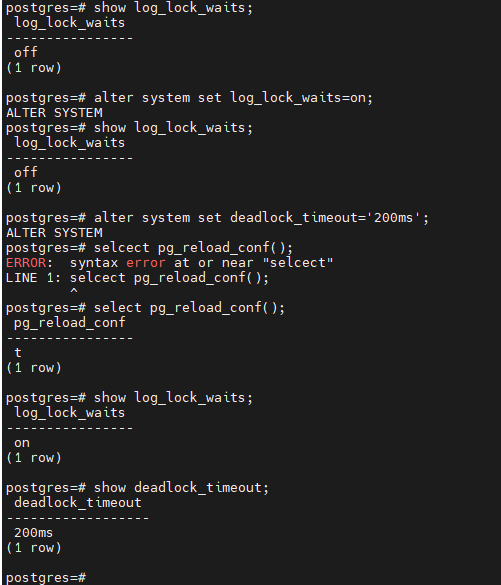
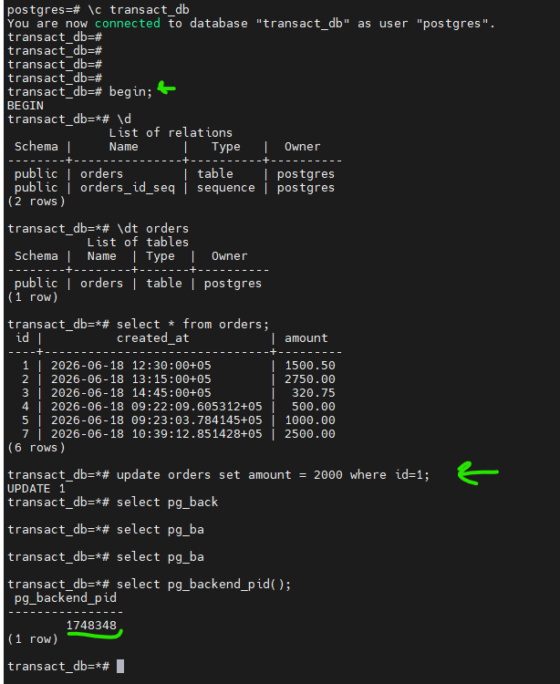
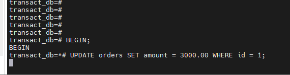
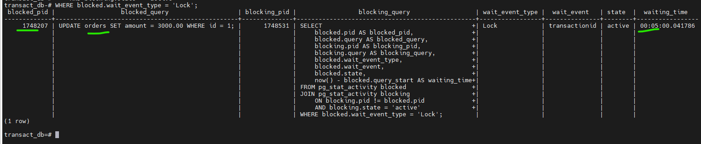
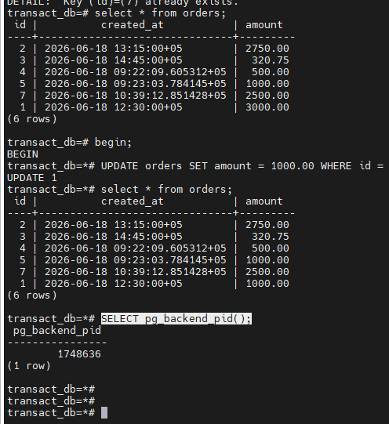
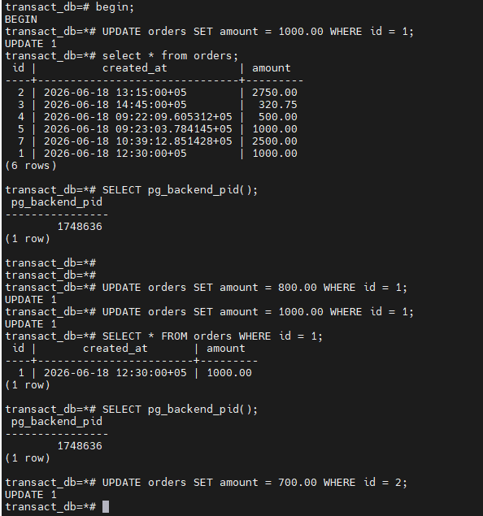
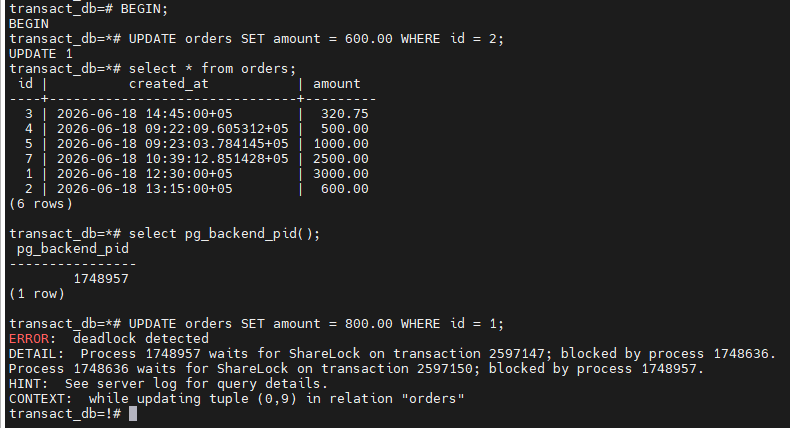
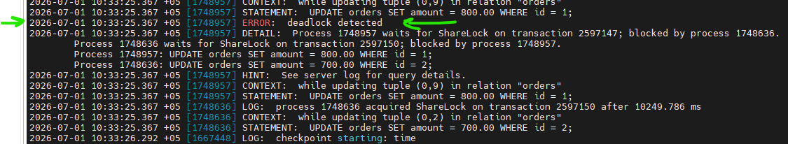
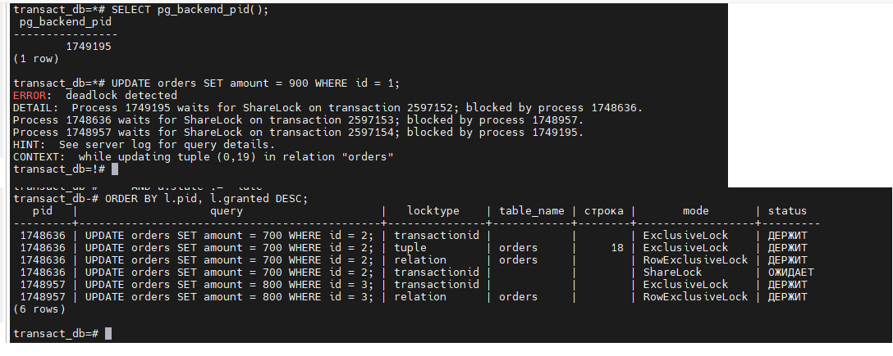
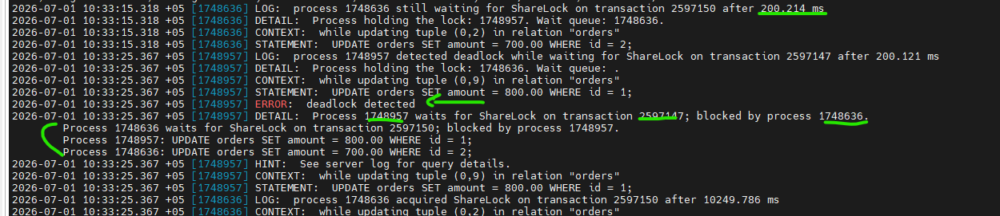

# Домашнее задание HW09

## Задание

### 1. Настройте PostgreSQL так, чтобы в журнал сообщений записывались ожидания блокировок дольше 200 мс;
### 2. Воспроизведите ожидание блокировки дольше 200 мс и подтвердите это записью в журнале сообщений;
### 3. Откройте три сессии psql к одной базе данных;
### 4. Создайте тестовую таблицу и добавьте одну строку, которую будут обновлять все сессии;
### 5. Выполните в трёх сессиях команды UPDATE, обновляющие одну и ту же строку, так чтобы одна транзакция удерживала блокировку, а остальные ожидали;
### 6. Во время ожидания снимите список блокировок из представления pg_locks и сохраните его для отчёта;
### 7. Объясните смысл каждой блокировки из pg_locks (что блокируется, какой режим, кто держит, кто ожидает);
### 8. Воспроизведите взаимоблокировку трех транзакций. Можно ли разобраться в ситуации постфактум, изучая журнал сообщений?
### 9. Могут ли две транзакции, выполняющие единственную команду UPDATE одной и той же таблицы (без where), заблокировать друг друга?

____________________________

# 1. Настройте PostgreSQL так, чтобы в журнал сообщений записывались ожидания блокировок дольше 200 мс;

Команды:
- show log_lock_waits;
- alter system set log_lock_waits=on;
- alter system set deadlock_timeout='200ms';
- select pg_reload_conf();

# 2.Воспроизведите ожидание блокировки дольше 200 мс и подтвердите это записью в журнале сообщений;

Подклюение в тепрминале 1 

Команды:
-begin;
-update orders set amount = 2000 where id=1;
-select pg_backend_pid();

Подключение в терминале 2 обновляем ту же запись одновременно в открытой транзакции 

Команды:
- BEGIN;
- UPDATE orders SET amount = 3000.00 WHERE id = 1;

Подключение в терминале 3 проверяем блокировки, чтобы посмотреть кто кого блокирует.

Запрос по выявлению блокировок и процессов с временем ожидания:

Команда:
- SELECT blocked.pid AS blocked_pid, blocked.query AS blocked_query, blocking.pid AS blocking_pid, blocking.query AS blocking_query, blocked.wait_event_type, blocked.wait_event, blocked.state, now() - blocked.query_start AS waiting_time FROM pg_stat_activity blocked JOIN pg_stat_activity blocking ON blocking.pid != blocked.pid AND blocking.state = 'active' WHERE blocked.wait_event_type = 'Lock';

Идём в лог и ищем сообщение с блокировкой 

# 3. Откройте три сессии psql к одной базе данных;

Выполнено, открыто три сессии к серверу.

# 4. Создайте тестовую таблицу и добавьте одну строку, которую будут обновлять все сессии;

Сессия 1 (бегин без коммита)

Команды:
-select * from orders;
-begin;
-UPDATE orders SET amount = 1000.00 WHERE id = 1;
-SELECT pg_backend_pid();

# 5. Выполните в трёх сессиях команды UPDATE, обновляющие одну и ту же строку, так чтобы одна транзакция удерживала блокировку, а остальные ожидали;

Команды:

Сессия 1

Сессия 2 

Сессия 3 идём в лог и видим запись о дедлоке

# 6. Во время ожидания снимите список блокировок из представления pg_locks и сохраните его для отчёта;

Команды:

- SELECT pid, locktype, relation::regclass AS table_name, page, tuple, virtualxid, transactionid, mode, granted, fastpath FROM pg_locks WHERE relation = 'orders'::regclass OR locktype = 'transactionid' ORDER BY pid, granted DESC;

# 7. Объясните смысл каждой блокировки из pg_locks (что блокируется, какой режим, кто держит, кто ожидает);

Мой первый процеесс PID 1748636 где обновил строку и не запустил коммит этот пид процесс - держит блокировку

Во второй сессии где я делаю обновление той же строки  пид 1749195  ждёт, так как в первой сессии я не закоммитил транзакцию.

Ещё выше в задании где создавали дедлок, дедлал обновление одной строки и следом делал обновление второй не запуская коммит.
И во второй сессии делал так же обновление строки не запуская коммит. В результате чего постгрес автоматически обнаружел дэдлок и вывел ошибку.

# 8. Воспроизведите взаимоблокировку трех транзакций. Можно ли разобраться в ситуации постфактум, изучая журнал сообщений?

Запусил пошаговое обновление в каждой строки не запустил коммит, и запустил заново обновление тех же строк.

так же 

события в логе на сервере

# 9. Могут ли две транзакции, выполняющие единственную команду UPDATE одной и той же таблицы (без where), заблокировать друг друга?

Дэдлока не будет, так как без записании условия в таблице, этот апдейт обновит все строки в таблице. А дэдлок будет при блокировке двух и более строк в разном порядке. При этом все остальные транзацкии будут ждать коммита или ролбэка.
