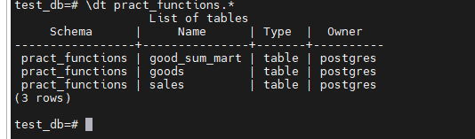
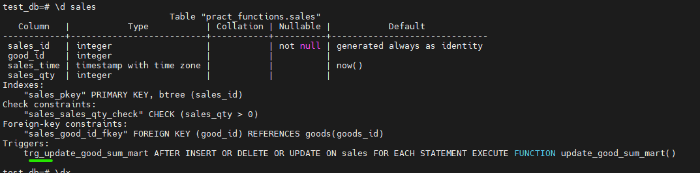
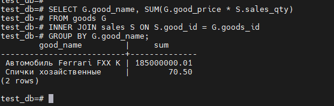
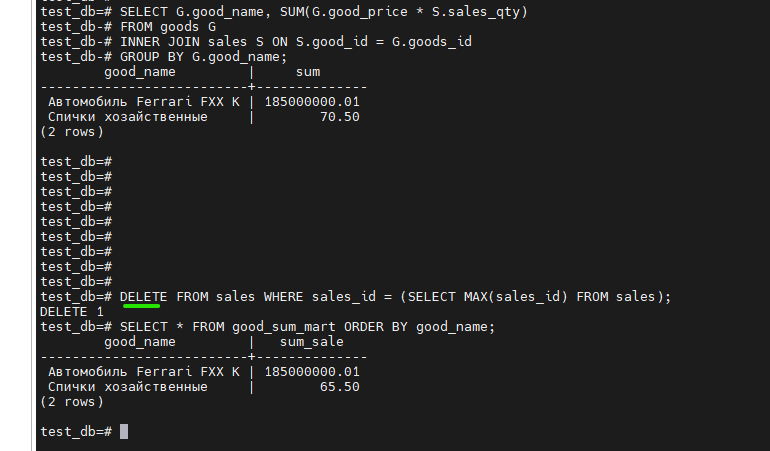
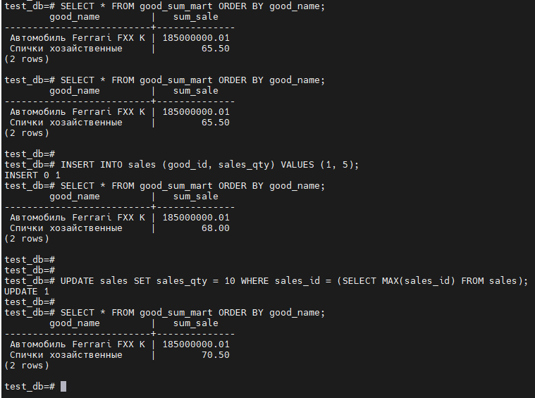

# Домашнее задание_18
Триггеры, поддержка заполнения витрин

Цель:
создать триггер для поддержки витрины данных в актуальном состоянии;

Описание/Пошаговая инструкция выполнения домашнего задания:

### 1. Cкрипт и развернутое описание задачи – в ЛК (файл hw_triggers.sql) или по ссылке: https://disk.yandex.ru/d/l70AvknAepIJXQ

### 2. В БД создана структура, описывающая товары (таблица goods) и продажи (таблица sales).

### 3. Есть запрос для генерации отчета – сумма продаж по каждому товару.

### 4. БД была денормализована, создана таблица (витрина), структура которой повторяет структуру отчета.

### 5. Создать триггер на таблице продаж, для поддержки данных в витрине в актуальном состоянии (вычисляющий при каждой продаже сумму и записывающий её в витрину)

Подсказка: не забыть, что кроме INSERT есть еще UPDATE и DELETE

____________________________

# 1 - 2. Скачал файл и развернул по структуре.  В БД создана структура, описывающая товары (таблица goods) и продажи (таблица sales).

Команды:
- создал по файлу hw_triggers.sql

# 2. В БД создана структура, описывающая товары (таблица goods) и продажи (таблица sales).

Создание процедуры и триггера как требуется в задании

# 3. Есть запрос для генерации отчета – сумма продаж по каждому товару.

Команды:
-SELECT G.good_name, SUM(G.good_price * S.sales_qty)FROM goods G INNER JOIN sales S ON S.good_id = G.goods_id GROUP BY G.good_name;

### 4. БД была денормализована, создана таблица (витрина), структура которой повторяет структуру отчета.

-SELECT * FROM good_sum_mart ORDER BY good_name;
-INSERT INTO sales (good_id, sales_qty) VALUES (1, 5);
-UPDATE sales SET sales_qty = 10 WHERE sales_id = (SELECT MAX(sales_id) FROM sales);
-DELETE FROM sales WHERE sales_id = (SELECT MAX(sales_id) FROM sales);

# 5. Создать триггер на таблице продаж, для поддержки данных в витрине в актуальном состоянии (вычисляющий при каждой продаже сумму и записывающий её в витрину)

Команды:

-CREATE FUNCTION update_good_sum_mart()
RETURNS TRIGGER AS $$
BEGIN
    TRUNCATE good_sum_mart;
    INSERT INTO good_sum_mart (good_name, sum_sale)
    SELECT G.good_name, SUM(G.good_price * S.sales_qty)
    FROM goods G
    INNER JOIN sales S ON S.good_id = G.goods_id
    GROUP BY G.good_name;
    RETURN NULL;
END;
$$ LANGUAGE plpgsql;

-CREATE TRIGGER trg_update_good_sum_mart AFTER INSERT OR UPDATE OR DELETE ON sales FOR EACH STATEMENT EXECUTE FUNCTION update_good_sum_mart();
