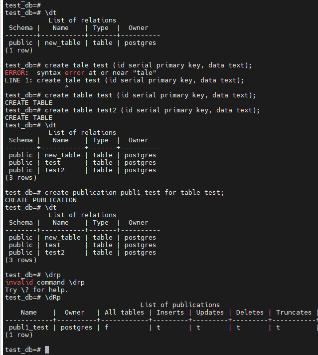
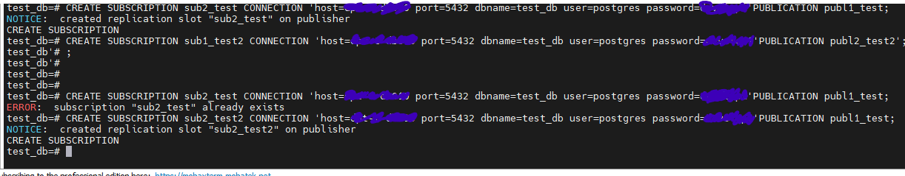
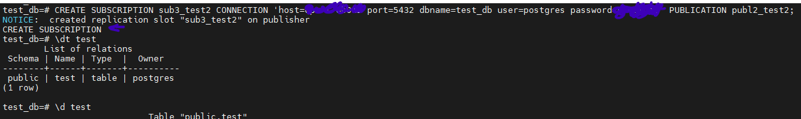
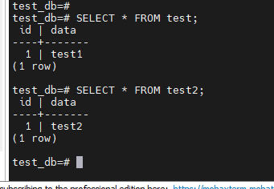

Репликация PostgreSQL

Описание/Пошаговая инструкция выполнения домашнего задания:

### 1. Настройте ВМ1:
-Создайте таблицу test, которая будет для операций записи
-Создайте таблицу test2, которая будет для чтения
-Настройте публикацию таблицы test

### 2. Настройте ВМ2:
Создайте таблицу test2, которая будет для операций записи
Создайте таблицу test, которая будет для чтения
Настройте публикацию таблицы test2
Сделайте подписку таблицы test на публикацию таблицы test с ВМ1

### 3. на ВМ1:

Сделайте подписку таблицы test2 на публикацию таблицы test2 с ВМ2

### 4. Настройте ВМ3:

Создайте таблицы: test и test2
Подпишите test на публикацию таблицы test с ВМ1
Подпишите test2 на публикацию таблицы test2 с ВМ2
Используйте этот узел для чтения объединённых данных и резервного копирования
Проверьте работу системы:

Выполните вставку в test на ВМ1 — убедитесь, что данные появились в test на ВМ2 и ВМ3
Выполните вставку в test2 на ВМ2 — убедитесь, что данные появились в test2 на ВМ1 и ВМ3

____________________________

#1. Настройка ВМ1

Команды:
-\c test_db
-create table test (id serial primary key, data text);
-create table test2 (id serial primary key, data text);
-\dt
-create publication publ1_test for table test;
--CREATE SUBSCRIPTION sub1_test2 CONNECTION 'host=ВМ2 port=5432 dbname=test_db user=postgres password=сложный_пароль'PUBLICATION publ2_test2'; (Скрыл имя хоста и пароль)

# 2. Настройте ВМ2:

Команды: 
-create table test2 (id serial primary key, data text);
-create table test (id serial primary key, data text);
-create publication publ2_test2 for table test2;
-CREATE SUBSCRIPTION sub2_test CONNECTION 'host=ВМ1 port=5432 dbname=test_db user=postgres password=сложный_пароль'PUBLICATION publ1_test;  (Скрыл имя хоста и пароль)

4. Настройка ВМ3

Команды:
-create table test (id serial primary key, data text);
-create table test2 (id serial primary key, data text);
-- Подписка на test с ВМ1 и ВМ2
CREATE SUBSCRIPTION sub3_test CONNECTION 'host=ВМ1 port=5432 dbname=test_db user=postgres password=сложный_пароль' PUBLICATION publ1_test; (Скрыл имя хоста и пароль)
CREATE SUBSCRIPTION sub3_test2 CONNECTION 'host=ВМ2 port=5432 dbname=test_db user=postgres password=сложный_пароль' PUBLICATION publ2_test2; (Скрыл имя хоста и пароль)

Проверяем.
Добавляем данные на ВМ1:
INSERT INTO test (data) VALUES ('test1');

Добавляем данные на ВМ2:
INSERT INTO test2 (data) VALUES ('test2');

Делаем проверку на всех ВМ:

SELECT * FROM test;
SELECT * FROM test2;

