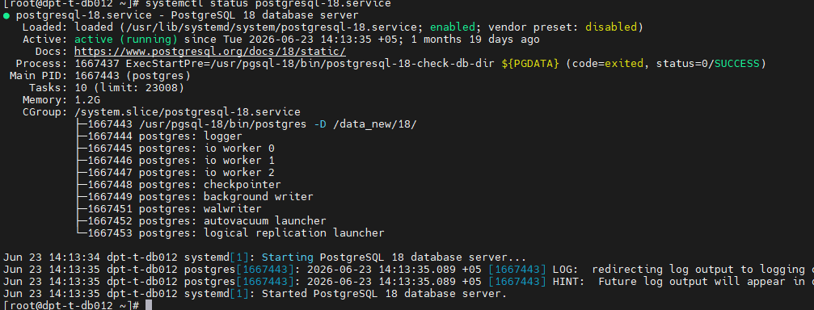
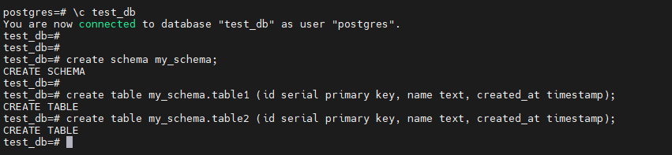
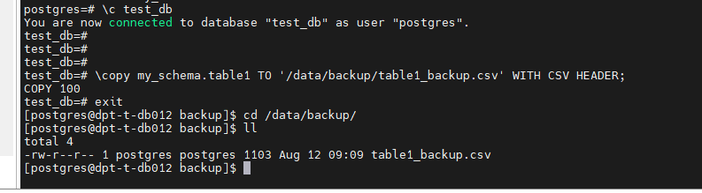
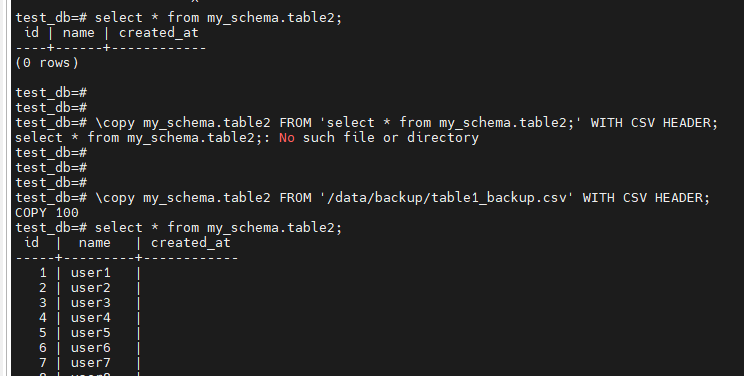
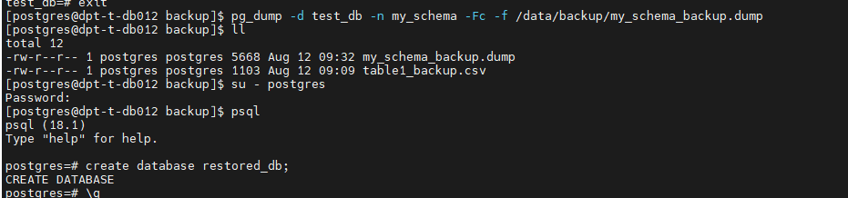
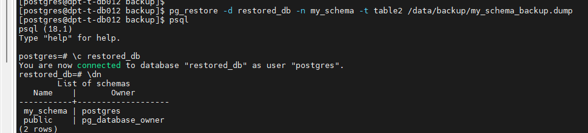

Описание/Пошаговая инструкция выполнения домашнего задания:

### 1. Развернуть PostgreSQL

### 2. В БД test_db создать схему my_schema и две одинаковые таблицы (table1, table2).

### 3. Заполнить table1 100 строками с помощью generate_series.

### 4.Создать каталог /var/lib/postgresql/backups/ под пользователем postgres.

### 5. Бэкап через COPY: Выгрузить table1 в CSV командой \copy.

### 6. Восстановление из COPY: Загрузить данные из CSV в table2.

### 7. Бэкап через pg_dump: создать кастомный сжатый дамп (-Fc) только схемы my_schema.

### 8. Восстановление через pg_restore: В новую БД restored_db восстановить только table2 из дампа.

Подсказка: не забыть, что кроме INSERT есть еще UPDATE и DELETE

____________________________

# 1. Развернуть PostgreSQL

# 2. В БД test_db создать схему my_schema и две одинаковые таблицы (table1, table2).

Команды:
- \c test_db
-create schema my_schema;
-create table my_schema.table1 (id serial primary key, name text, created_at timestamp);
-create table my_schema.table2 (id serial primary key, name text, created_at timestamp);

# 3. Заполнить table1 100 строками с помощью generate_series.

Команды:
-insert into my_schema.table1 (name) select 'user' || generate_series from generate_series(1,100);
-select * from my_schema.table1 limit 10;

### 4- 5 Создать каталог /var/lib/postgresql/backups/ под пользователем postgres. Бэкап через COPY: Выгрузить table1 в CSV командой \copy.

Команды: (есть пустой каталог дата на этом сервере создал папку там владелец папки postgres)
-mkdir /data/backup
-\c test_db
-\copy my_schema.table1 TO '/data/backup/table1_backup.csv' WITH CSV HEADER;

# 6. Восстановление из COPY: Загрузить данные из CSV в table2.

Команды:
- \c test_db
- select * from my_schema.table2;
- \copy my_schema.table2 FROM '/data/backup/table1_backup.csv' WITH CSV HEADER;

# 7. Бэкап через pg_dump: создать кастомный сжатый дамп (-Fc) только схемы my_schema.

Команды:

-pg_dump -d test_db -n my_schema -Fc -f /data/backup/my_schema_backup.dump
- createdb restored_db
- create schema my_schema;

# 8. Восстановление через pg_restore: В новую БД restored_db восстановить только table2 из дампа.

Команды:
- pg_restore -d restored_db -n my_schema -t table2 /data/backup/my_schema_backup.dump

- После копирования select count(*) from my_schema.table2;

