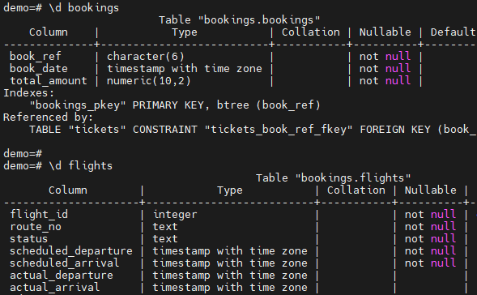
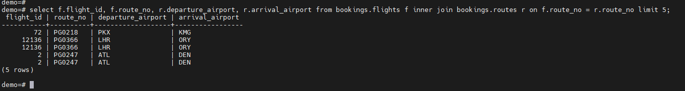
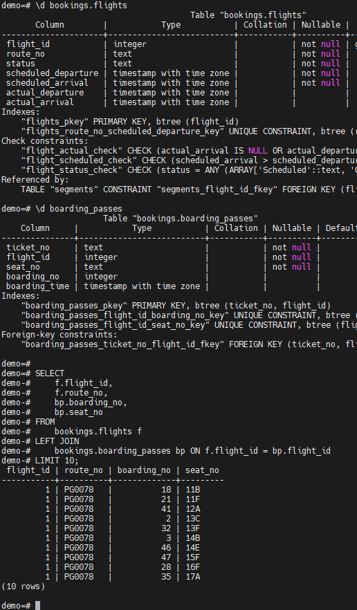
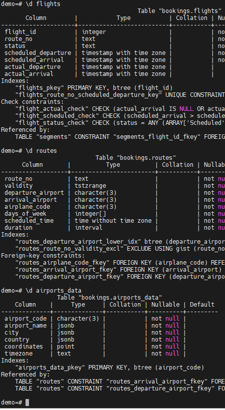
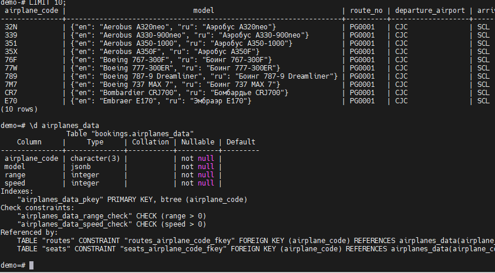
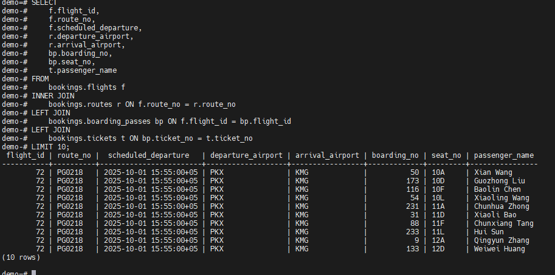
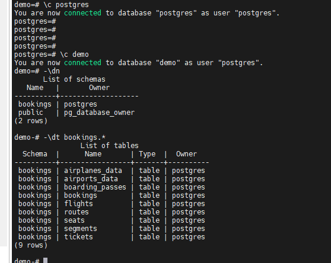
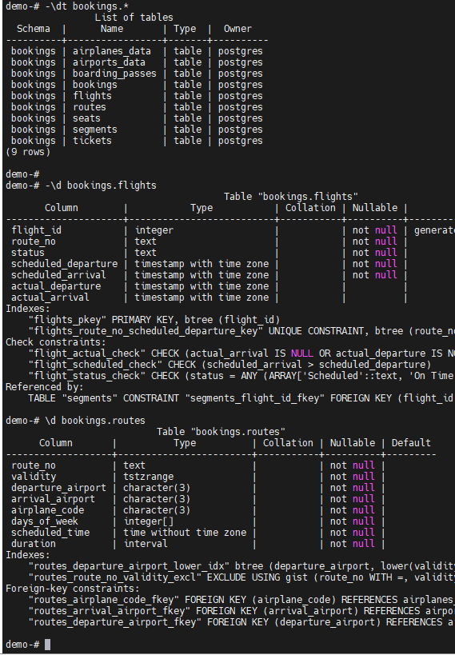
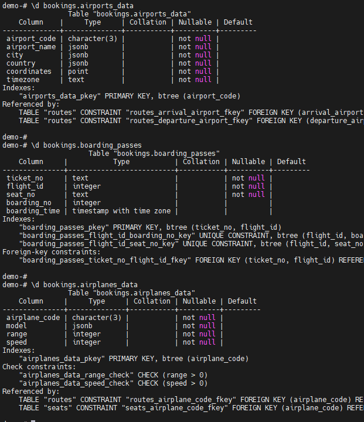
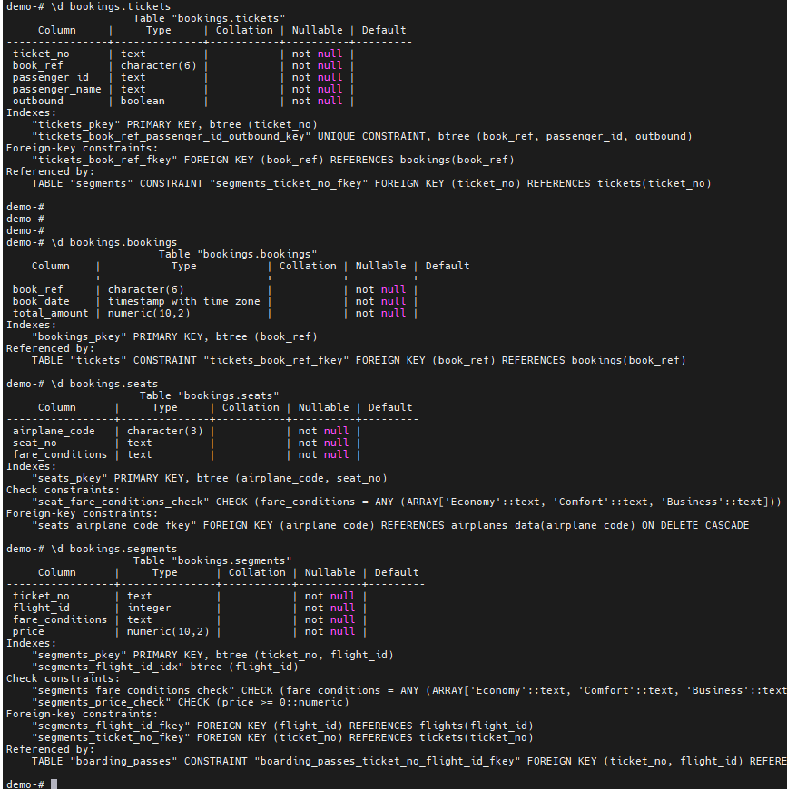

# Домашнее задание HW011

## Задание

# для выполенения домашнего задания взята демонстрационная база данных прилагаемая от потсгресо про https://postgrespro.ru/education/demodb  Для Удобства воспроизведения задания по джойнами.

### 1. Реализовать прямое соединение двух или более таблиц
### 2. Реализовать левостороннее (или правостороннее)
### 3. Cоединение двух или более таблиц
### 4. Реализовать кросс соединение двух или более таблиц
### 5. Реализовать полное соединение двух или более таблиц
### 6. Реализовать запрос, в котором будут использованы
### 7. Разные типы соединений
### 8. Сделать комментарии на каждый запрос
### 9 .К работе приложить структуру таблиц, для которых
выполнялись соединения

____________________________

# 1. Реализовать прямое соединение двух или более таблиц (как во вчерашней лекции важным условием является f.route_no = r.route_no, чтобы найти совпадения в таблице routes)

Команды:
-\c demo
-\d bookings
-\d flights
- select f.flight_id, f.route_no, r.departure_airport, r.arrival_airport from bookings.flights f inner join bookings.routes r on f.route_no = r.route_no limit 5;

# 2. Реализовать левостороннее (или правостороннее) (LEFT JOIN: все рейсы + посадочные талоны (если есть)  Если у рейса нет талона,  будет NULL)

Команды:

-\d bookings.flights
-\d boarding_passes

SELECT 
    f.flight_id,
    f.route_no,
    bp.boarding_no,
    bp.seat_no
FROM 
    bookings.flights f
LEFT JOIN 
    bookings.boarding_passes bp ON f.flight_id = bp.flight_id
LIMIT 10;

# 3. Cоединение двух или более таблиц (внутренний джоин трех таблиц: flights,  routes и airports_data  Получим информациб о  рейсе и аэропорт вылета с названием и городом)

Команды:

-\d flights
- \d routes
-\d airports_data
- SELECT f.flight_id, f.route_no, f.scheduled_departure, r.departure_airport, ad.airport_name AS departure_airport_name, ad.city AS departure_city FROM bookings.flights f INNER JOIN bookings.routes r ON f.route_no = r.route_no 
INNER JOIN bookings.airports_data ad ON r.departure_airport = ad.airport_code LIMIT 5;

# 4. Реализовать кросс соединение двух или более таблиц.  (кросс собирает все возможные комбинации самолётов и маршрута)

Команды:
-\c demo
-\dt
- SELECT a.airplane_code, a.model, r.route_no, r.departure_airport, r.arrival_airport FROM bookings.airplanes_data a CROSS JOIN bookings.routes r LIMIT 10;

# 5. Реализовать полное соединение двух или более таблиц (все рейсы и все посадочные талоны)

Команды:
-\c demo
-\dt
-SELECT f.flight_id, f.route_no, bp.boarding_no, bp.seat_no FROM bookings.flights f FULL JOIN bookings.boarding_passes bp ON f.flight_id = bp.flight_id LIMIT 10;

### 6- 7 Реализовать запрос, в котором будут использованы.  Разные типы соединений. (рейсы и маршруты и талоны плюс билеты)

-\c demo
-
-SELECT f.flight_id, f.route_no, f.scheduled_departure, r.departure_airport, r.arrival_airport, bp.boarding_no, bp.seat_no, t.passenger_name FROM bookings.flights f INNER JOIN bookings.routes r ON f.route_no = r.route_no
LEFT JOIN 
bookings.boarding_passes bp ON f.flight_id = bp.flight_id
LEFT JOIN 
bookings.tickets t ON bp.ticket_no = t.ticket_no
LIMIT 10;

# 9. К работе приложить структуру таблиц, для которых выполнялись соединения

Структура таблиц

Команды:
-\с demo
-\dn 
-\dt bookings.* (все таблицы в схеме)
-\d bookings.flights (Рейс)
-\d bookings.routes (Маршрут)
-\d bookings.airports_data (Аэропорт)
-\d bookings.boarding_passes (талон посадочный)
-\d bookings.airplanes_data   (Самолёты)
-\d bookings.tickets (билет)
-\d bookings.bookings (Бронирование рейса)
-\d bookings.seats (Места)
-\d bookings.segments (Сегмент пересадка между городами полёта)

