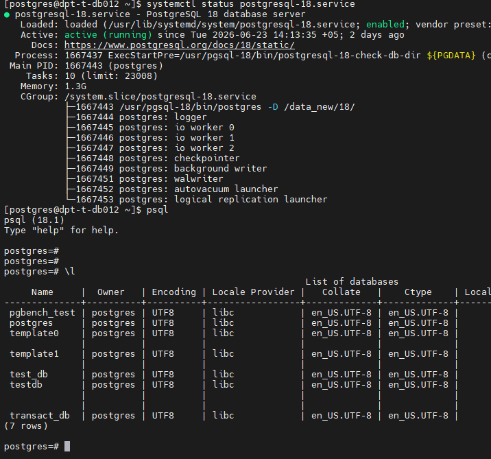
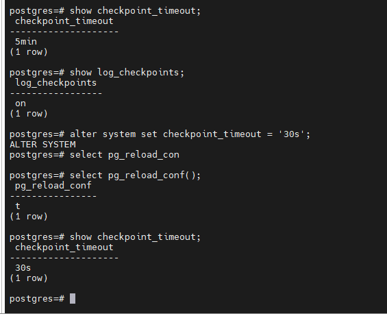
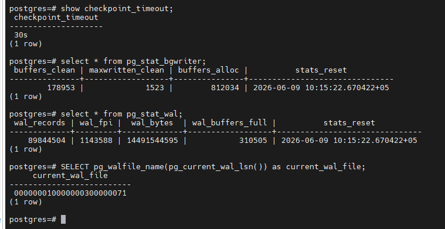
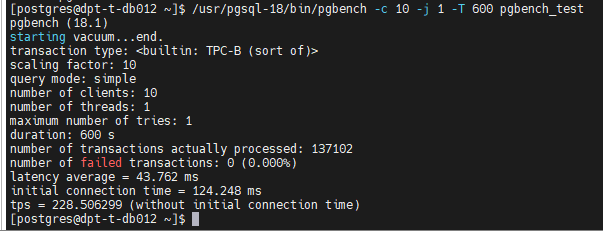
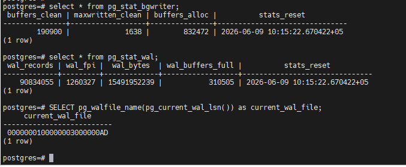
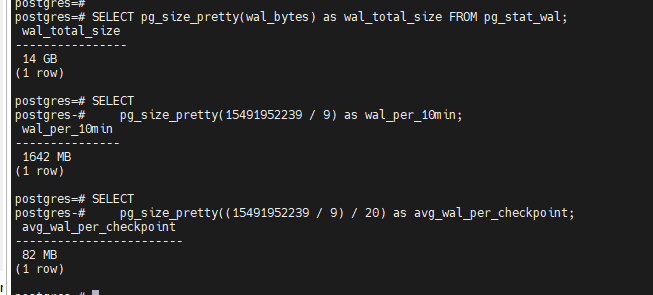
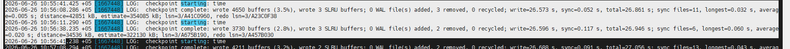
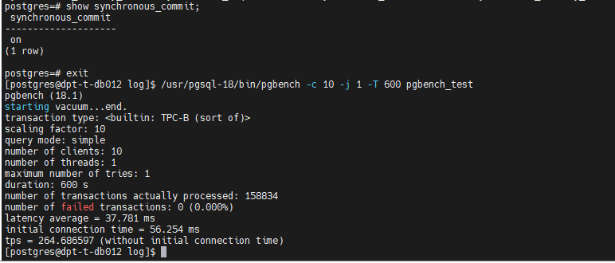
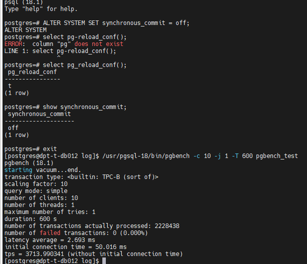

# Домашнее задание HW08

## Задание

### 1. Используйте стенд с PostgreSQL 17 (допускается ВМ из предыдущих ДЗ) и установите pgbench;
### 2. Настройте выполнение контрольной точки раз в 30 секунд (параметр времени) и включите логирование контрольных точек;
### 3. Зафиксируйте начальные значения статистики контрольных точек и WAL (снимок «до»);
### 4. Запустите нагрузку pgbench на 10 минут и зафиксируйте TPS;
### 5. Зафиксируйте конечные значения статистики контрольных точек и WAL (снимок «после»);
### 6. Рассчитайте объём WAL за 10 минут и средний объём WAL на одну контрольную точку;
### 7. Проверьте по статистике/логам, выполнялись ли контрольные точки строго по расписанию, и объясните отклонения;
### 8. Сравните TPS при синхронном и асинхронном подтверждении коммита (2 прогона pgbench в сопоставимых условиях) и объясните разницу;

____________________________

# 1. Используйте стенд с PostgreSQL 17 (допускается ВМ из предыдущих ДЗ) и установите pgbench;

Стенд создан.

# 2. Настройте выполнение контрольной точки раз в 30 секунд (параметр времени) и включите логирование контрольных точек;

Команды:
-show checkpoint_timeout;
-show log_checkpoints;
-alter system set checkpoint_timeout = '30s';
-select pg_reload_conf();
-show checkpoint_timeout;

# 3. Зафиксируйте начальные значения статистики контрольных точек и WAL (снимок «до»);

Команды:

-select * from pg_stat_bgwriter;
-select * from pg_stat_wal;
-SELECT pg_walfile_name(pg_current_wal_lsn()) as current_wal_file;

# 4. Запустите нагрузку pgbench на 10 минут и зафиксируйте TPS;

Команды:
-/usr/pgsql-18/bin/pgbench -c 10 -j 1 -T 600 pgbench_test

# 5. Зафиксируйте конечные значения статистики контрольных точек и WAL (снимок «после»);

Команды:

-select * from pg_stat_bgwriter;
-select * from pg_stat_wal;
-SELECT pg_walfile_name(pg_current_wal_lsn()) as current_wal_file;

# 6. Рассчитайте объём WAL за 10 минут и средний объём WAL на одну контрольную точку;

Команды:

-select * from pg_stat_wal;
-select pg_size_pretty(wal_bytes) as wal_total_size FROM pg_stat_wal;
-pg_size_pretty(15491952239 / 9) as wal_per_10min;
-select pg_size_pretty((15491952239 / 9) / 20) as avg_wal_per_checkpoint;

# 7. Проверьте по статистике/логам, выполнялись ли контрольные точки строго по расписанию, и объясните отклонения;

Выдержка из логов: События есть чекпоинт срабатывал

2026-06-26 10:55:41.425 +05 [1667448] LOG:  checkpoint starting: time
2026-06-26 10:56:08.286 +05 [1667448] LOG:  checkpoint complete: wrote 4650 buffers (3.5%), wrote 3 SLRU buffers; 0 WAL file(s) added, 3 removed, 0 recycled; write=26.573 s, sync=0.052 s, total=26.861 s; sync files=11, longest=0.032 s, average=0.005 s; distance=42851 kB, estimate=354085 kB; lsn=3/A41C0960, redo lsn=3/A23C0F38
2026-06-26 10:56:11.290 +05 [1667448] LOG:  checkpoint starting: time
2026-06-26 10:56:38.235 +05 [1667448] LOG:  checkpoint complete: wrote 3730 buffers (2.8%), wrote 3 SLRU buffers; 0 WAL file(s) added, 2 removed, 0 recycled; write=26.596 s, sync=0.117 s, total=26.946 s; sync files=6, longest=0.060 s, average=0.020 s; distance=34536 kB, estimate=322130 kB; lsn=3/A675B190, redo lsn=3/A457B030
2026-06-26 10:56:41

# 8. Сравните TPS при синхронном и асинхронном подтверждении коммита (2 прогона pgbench в сопоставимых условиях) и объясните разницу;

Команды:
- show synchronous_commit;  (Статус ON)
- /usr/pgsql-18/bin/pgbench -c 10 -j 1 -T 600 pgbench_test

#. После переключения синхронного коммита в асинхронный

Команды:
- ALTER SYSTEM SET synchronous_commit = off;
- SELECT pg_reload_conf();

# Объяснение разницы:
Асинхронный режим (synchronous_commit = off) убирает ожидание записи на диск, которое является самым узким местом по скорости. 
Вместо этого транзакции подтверждаются сразу после записи WAL в буфер в памяти, что даёт сильное ускорение, за счёт уменьшения задержки с 37.78 мс до 2.69 мс. Это достигается ценой потенциальной потери данных.
