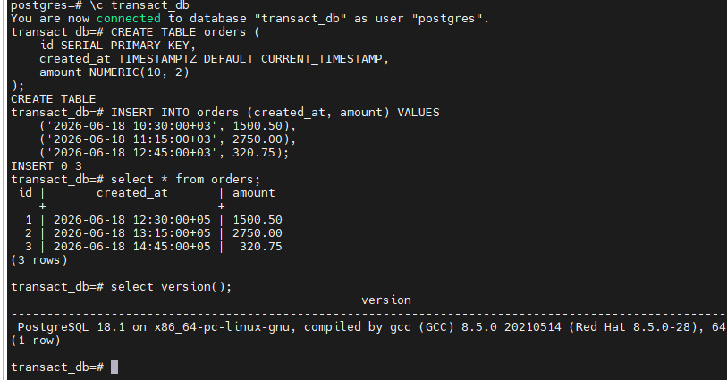
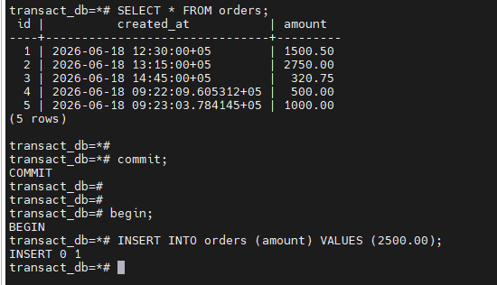
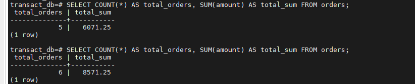
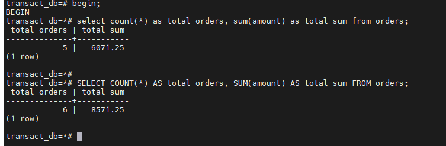
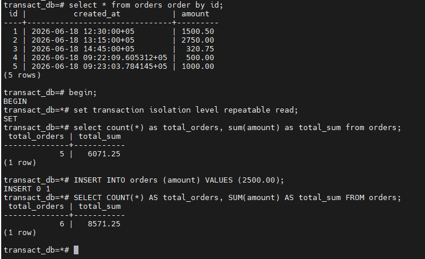
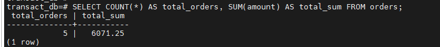

# Домашнее задание HW05

Задание:

### 1. Откройте 2 сессии psql к PostgreSQL 17 и отключите autocommit;
### 2. Создайте таблицу orders(id serial, created_at timestamptz, amount numeric) и вставьте 2–3 записи;
### 3. Read committed: в сессии 2 начните транзакцию и выполните select count(*), sum(amount) ... за последнюю минуту; в сессии 1 вставьте новый заказ и выполните commit; в сессии 2 повторите тот же select и зафиксируйте изменение; завершите транзакции;
### 4. Repeatable read: повторите сценарий, но обе транзакции начните с set transaction isolation level repeatable read;; сравните результаты внутри транзакции и после её завершения;
### 5. В отчёте укажите, где и почему меняются значения, и какой уровень изоляции нужен для отчёта;

____________________

# 1. Используйте существующую ВМ/стенд с PostgreSQL;

Стенд создан под postgresql 18.1

# 2. Создайте таблицу orders(id serial, created_at timestamptz, amount numeric) и вставьте 2–3 записи;

Команды:
-create database transact_db;
-CREATE TABLE orders (id SERIAL PRIMARY KEY, created_at TIMESTAMPTZ DEFAULT CURRENT_TIMESTAMP, amount NUMERIC(10, 2)
-INSERT INTO orders (created_at, amount) VALUES
    ('2026-06-18 10:30:00+03', 1500.50),
    ('2026-06-18 11:15:00+03', 2750.00),
    ('2026-06-18 12:45:00+03', 320.75);
	
- версия тестового стенда select version();	

 

# 3. Read committed: в сессии 2 начните транзакцию и выполните select count(*), sum(amount) ... за последнюю минуту; в сессии 1 вставьте новый заказ и выполните commit; в сессии 2 повторите тот же select и зафиксируйте изменение; завершите транзакции;

Команды: (терминал1 бегин и инсерт без коммита)
-begin;
-INSERT INTO orders (amount) VALUES (2500.00);

Терминал 2

Команды: Как раз не видна вставка 2500 из терминала 1 так как в первом терминале не закоммитил транзакцию.
-begin;
-select count(*) as total_orders, sum(amount) as total_sum from orders;

Делаем коммит в первом терминале и считаем сумму во втором терминале

# 4. Repeatable read: повторите сценарий, но обе транзакции начните с set transaction isolation level repeatable read;; сравните результаты внутри транзакции и после её завершения;

Команды терминал1:

-begin;
-set transaction isolation level repeatable read;
-select count(*) as total_orders, sum(amount) as total_sum from orders;
-INSERT INTO orders (amount) VALUES (2500.00);
-SELECT COUNT(*) AS total_orders, SUM(amount) AS total_sum FROM orders;

До и после коммита

# 5. В отчёте укажите, где и почему меняются значения, и какой уровень изоляции нужен для отчёта; Если нужен статичный отчёт (без изменений внутри транзакции):

Read Committed – стандартный уровень, допускает неповторяемое чтение

Repeatable Read – обеспечивает стабильный снимок данных на всё время транзакции

Для формирования согласованных отчётов лучше использовать Repeatable Read

Для мониторинга в реальном времени подходит Read Committed
