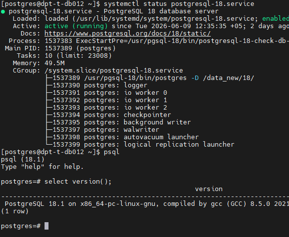
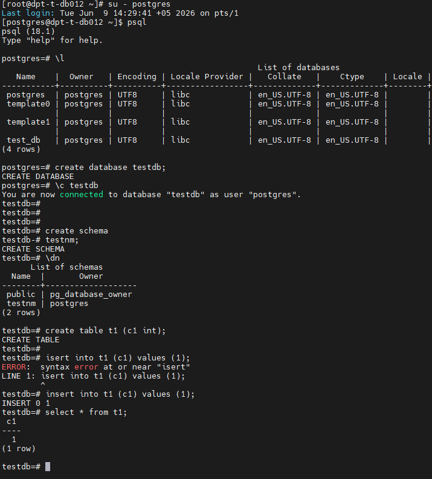
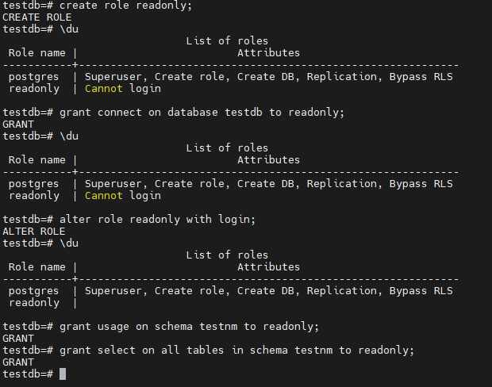
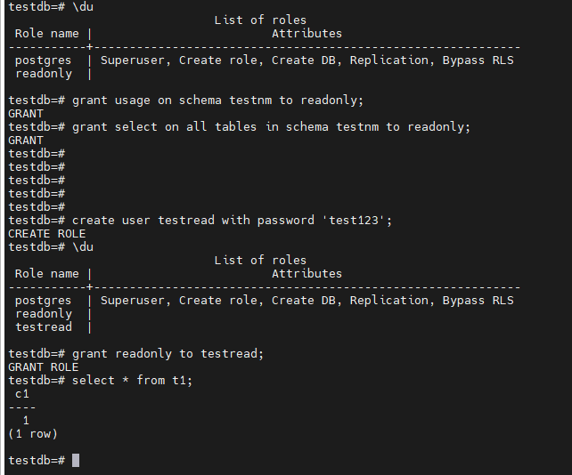
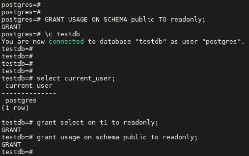
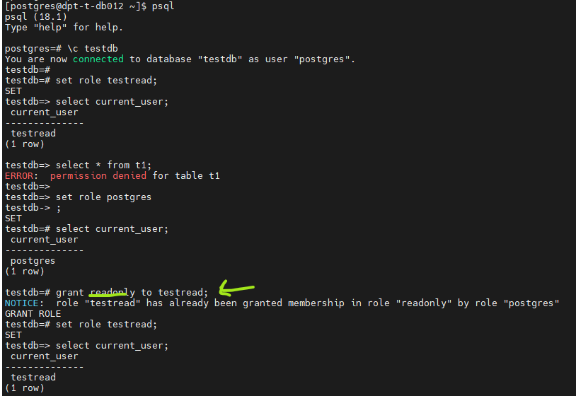
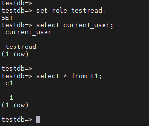
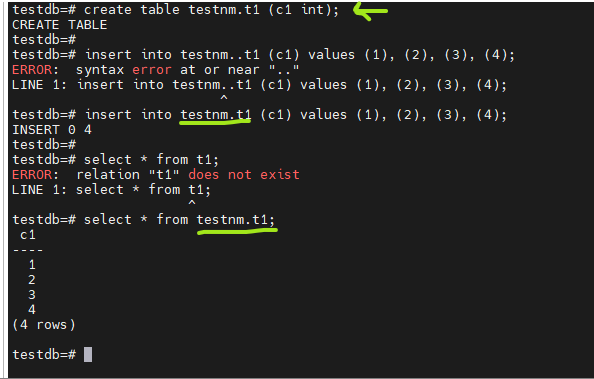
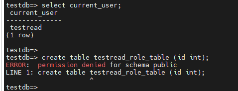
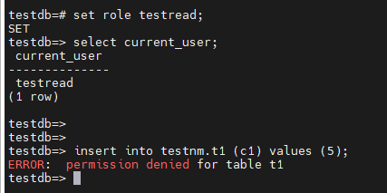

# Домашнее задание HW03

## Задание

### 1. Создайте кластер PostgreSQL 17 и базу testdb;

### 2. Создайте схему testnm, таблицу t1(c1 int) и вставьте строку;

### 3. Создайте роль readonly, выдайте ей CONNECT к testdb, USAGE на testnm, SELECT на таблицы схемы testnm;

### 4. Создайте пользователя testread/test123, назначьте роль readonly, выполните select * from t1; и зафиксируйте результат;

### 5. Пересоздайте таблицу как testnm.t1, проверьте select * from testnm.t1; и настройте поведение, чтобы обращение к t1 было предсказуемым;

### 6. Под testread проверьте попытку create table и insert; при необходимости запретите и подтвердите запрет повторной проверкой.

____________________________

# 1. Создайте кластер PostgreSQL 18 и базу testdb;

# 2. Создайте схему testnm, таблицу t1(c1 int) и вставьте строку;

Команды:
- create database testdb;
- create table t1 (c1 int);
- insert into t1 (c1) values (1);

# 3. Создайте роль readonly, выдайте ей CONNECT к testdb, USAGE на testnm, SELECT на таблицы схемы testnm;

Команды:
 - create role readonly;
- alter role readonly with login;
- grant connect on database testdb to readonly;
- grant usage on schema testnm to readonly;
- grant select on all tables in schema testnm to readonly;

# 4. Создайте пользователя testread/test123, назначьте роль readonly, выполните select * from t1; и зафиксируйте результат;

Команды:
- create user testread with password 'test123';
- grant readonly to testread;
- select * from t1;

# Доработка:

Команды:
- grant readonly to testread;
- grant select on t1 to readonly;
- grant usage on schema public to readonly;

  
  
  

# 5. Пересоздайте таблицу как testnm.t1, проверьте select * from testnm.t1; и настройте поведение, чтобы обращение к t1 было предсказуемым;

Команды:
- create table testnm.t1 (c1 int);
- insert into testnm.t1 (c1) values (1), (2), (3), (4);
- select * from testnm.t1;

# 6. Под testread проверьте попытку create table и insert; при необходимости запретите и подтвердите запрет повторной проверкой.

Команды:
- set role testread;
- select current_user;
- create table testread_role_table (id int);

 - set role testread;
 - select current_user;
 - insert into testnm.t1 (c1) values (5);

# PS:  не совсем понял вот эту часть  задания (при необходимости запретите и подтвердите запрет повторной проверкой.)  Зачем прописывать revoke  если прав на вставку и создание нет. Об этом видно на скрине Permission Denied Или это просто опечатка? Или нужно наоборот выдать грант на создание и проверить, что создалось?
