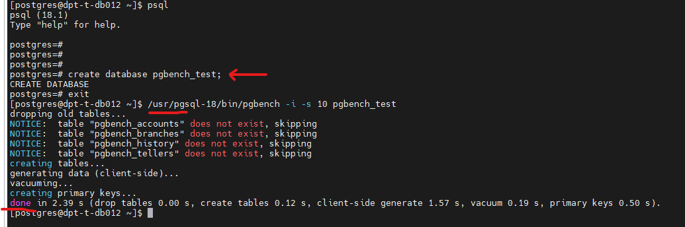
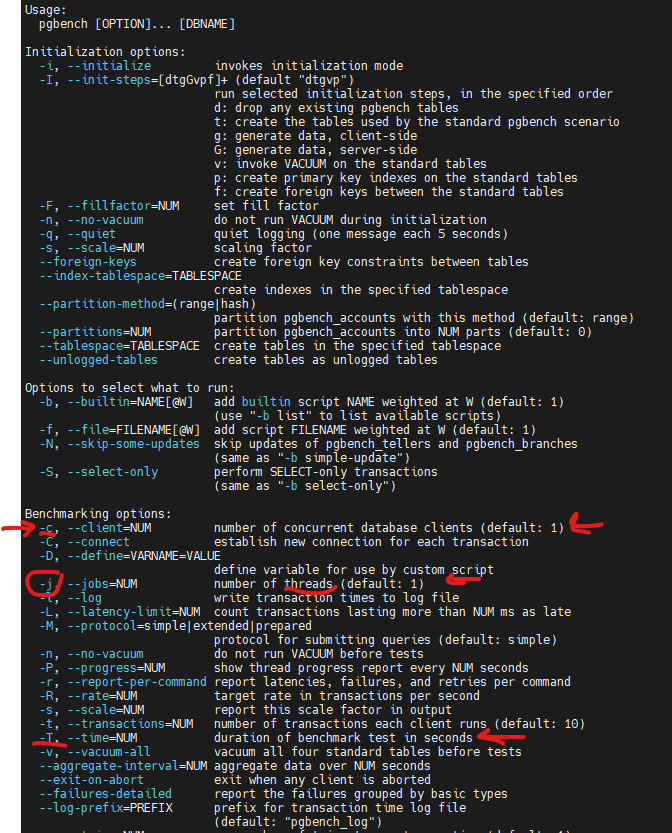
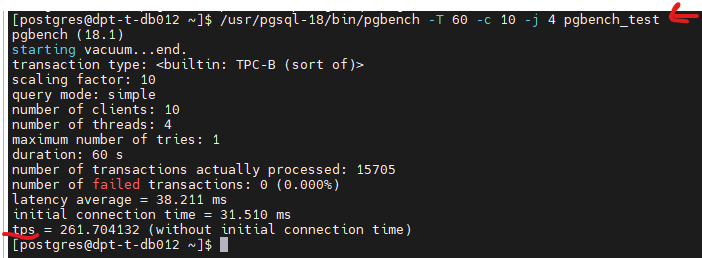
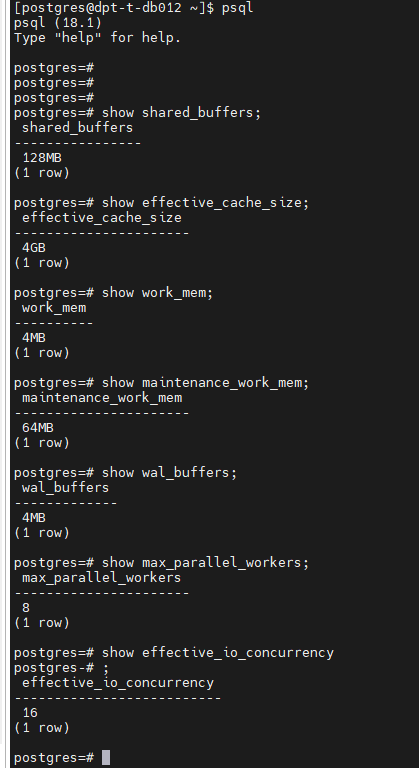
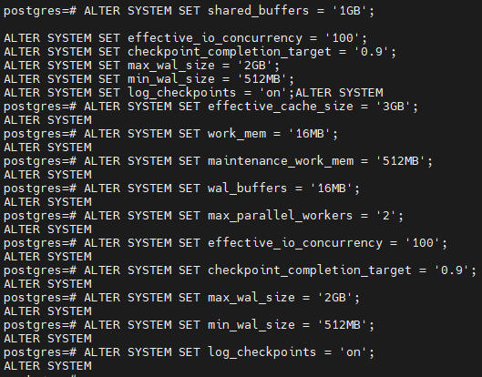
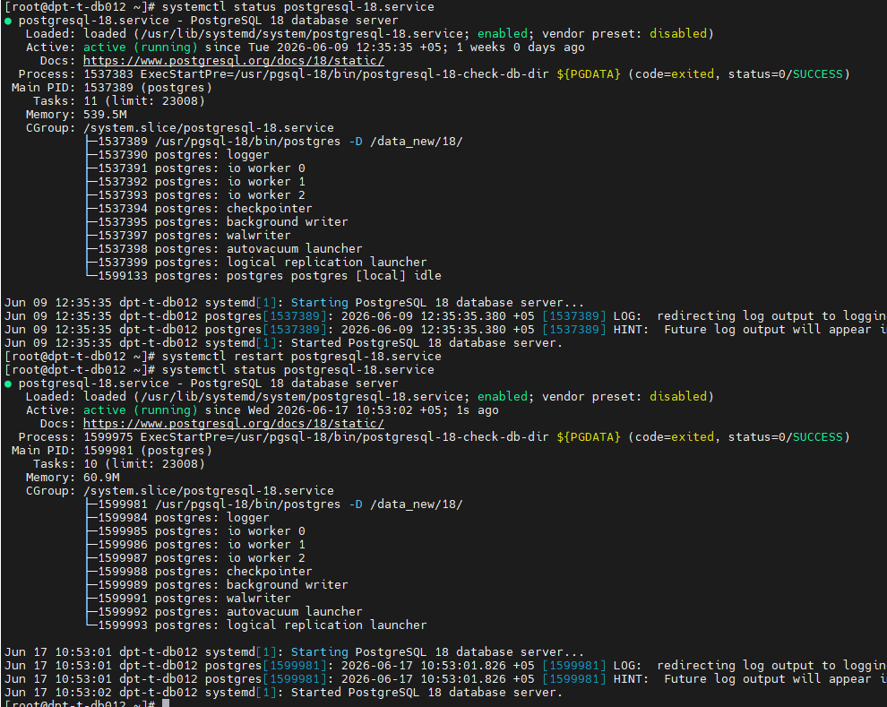
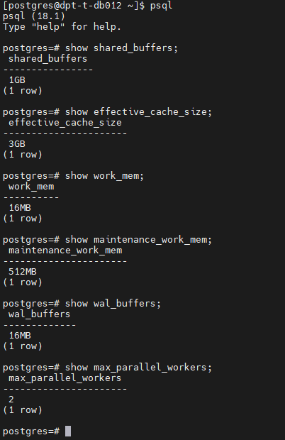
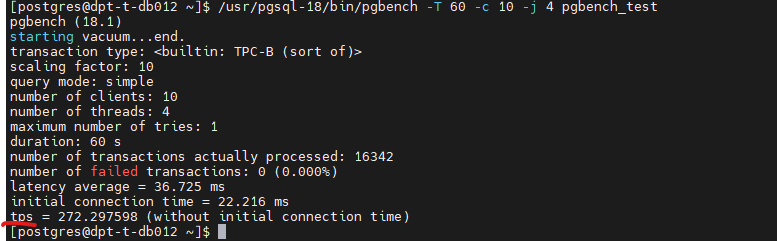

# Домашнее задание HW04

## Задание

### 1. Используйте существующую ВМ/стенд с PostgreSQL;
### 2. Подготовьте pgbench: инициализируйте тестовую базу (scale выбрать 10);
### 3. Выполните baseline-прогон pgbench с фиксированными настройками (например, 60 секунд, 10 клиентов, 4 потока);
### 4. Зафиксируйте tps baseline и условия теста (scale, время, клиенты/потоки);
### 5. Измените параметры PostgreSQL для получения максимальной производительности
### 6. Перезапустите кластер (если требуется) и повторите pgbench с теми же настройками;
### 7. Сравните tps до/после и сделайте вывод, какие изменения дали эффект;
### 8. Кратко обоснуйте изменение каких параметров больше всего влияет на повышение производительности;

____________________________

# 1. Используйте существующую ВМ/стенд с PostgreSQL;

Стенд создан под postgresql 18.1

# 2. Подготовьте pgbench: инициализируйте тестовую базу (scale выбрать 10);

Команды:
- create database pgbench_test;
- /usr/pgsql-18/bin/pgbench -i -s 10 pgbench_test

# 3. Выполните baseline-прогон pgbench с фиксированными настройками (например, 60 секунд, 10 клиентов, 4 потока);

Команды:
-/usr/pgsql-18/bin/pgbench --help
-/usr/pgsql-18/bin/pgbench -T 60 -c 10 -j 4 pgbench_test

# 4. Зафиксируйте tps baseline и условия теста (scale, время, клиенты/потоки);

# 5. Измените параметры PostgreSQL для получения максимальной производительности

# Текущий конфиг тестовой ВМ:
CPU -2
RAM - 4GB
Дефолтный конфиг постгреса на нём был запущен первый тест по пункту 3 ДЗ, и сделан замер tps

 

# 5. Измените параметры PostgreSQL для получения максимальной производительности

# Изменённый конфиг для последующего замера tps

 

# 6. Перезапустите кластер (если требуется) и повторите pgbench с новыми настройками;

 

# Проверка новых параметров.

 

# 7. Сравните tps до/после и сделайте вывод, какие изменения дали эффект;

# Тест до смены дефолтного конфига из коробки

# Тест на новом конфиге postgresql.conf

# при выполнении той же команды:
- /usr/pgsql-18/bin/pgbench -T 60 -c 10 -j 4 pgbench_test

# Буст в производительности есть наплядно на скринах есть изменение показателей и по tps и по латтенси.

# 8. Кратко обоснуйте изменение каких параметров больше всего влияет на повышение производительности;

Думаю, что важные и основные изменения получили:  это смена shared_buffers и work_mem   Использовал калькулятор настроек как в показаны в занятии https://pgtune.leopard.in.ua/

Поправил параметры относительно формул калькулятора пг_тюн.
