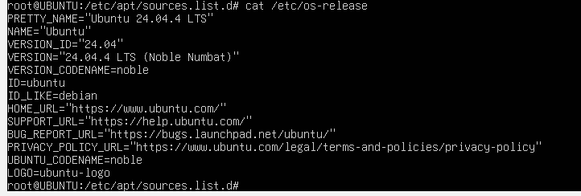
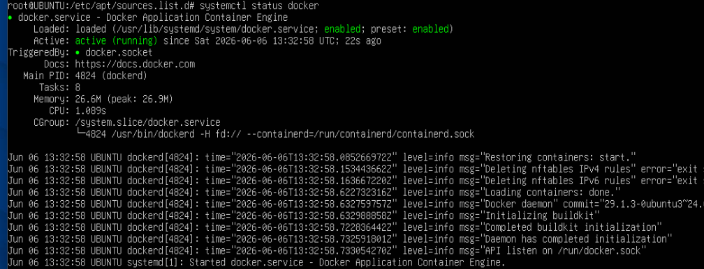
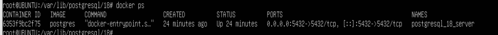
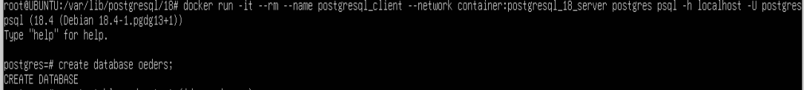
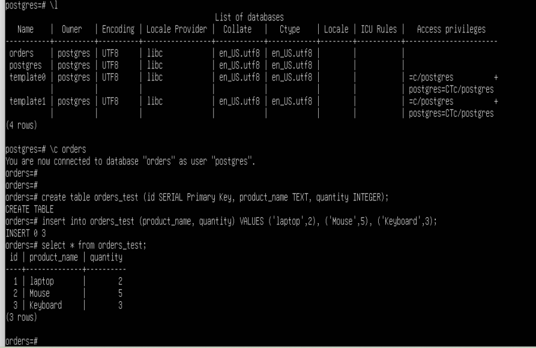
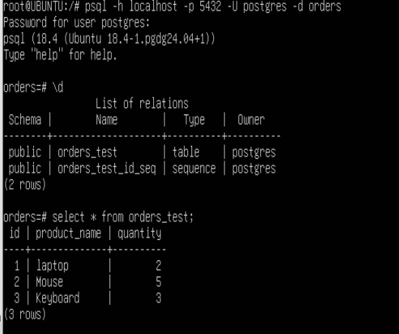
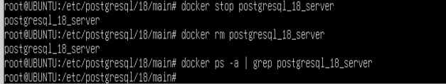
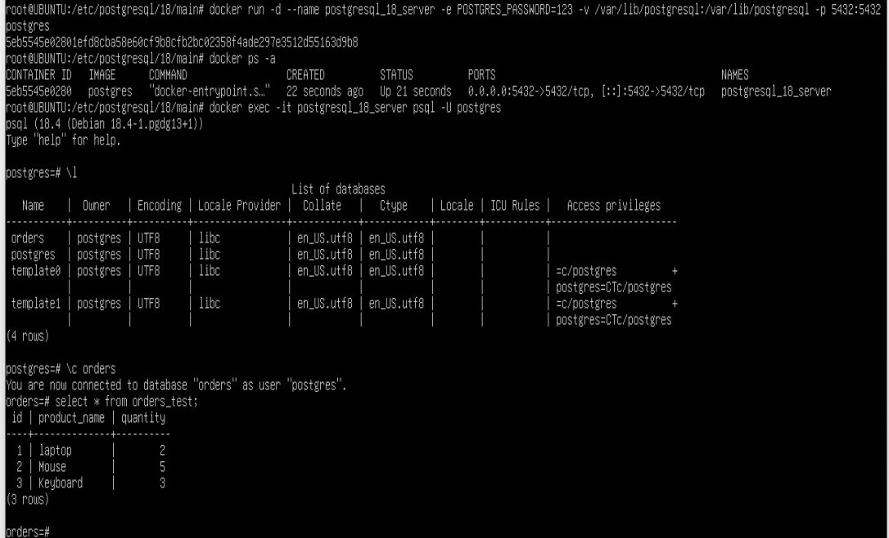

Задания

- Создайте ВМ с Ubuntu 22.04/24.04 или подготовьте хост, на котором будет развёрнут Docker;
- Установите Docker Engine;
- Создайте каталог для данных PostgreSQL на хосте: /var/lib/postgresql;
- Разверните контейнер с PostgreSQL, смонтировав каталог хоста в каталог данных контейнера и пробросив порт 5432 для внешнего подключения;
- Разверните контейнер с клиентом PostgreSQL (psql);
- Подключитесь из контейнера с клиентом к контейнеру с сервером; создайте таблицу orders_test и добавьте минимум 2 строки;
- Подключитесь к PostgreSQL с ноутбука/рабочего компьютера извне хоста (по адресу хоста и порту 5432); выполните проверочный select из таблицы orders_test;
- Остановите и удалите контейнер с сервером PostgreSQL;
- Создайте контейнер с сервером заново, используя тот же смонтированный каталог данных;
- Подключитесь повторно из контейнера с клиентом и извне; проверьте, что строки в orders_test сохранились;
______________________________________
 **Создайте ВМ с Ubuntu 22.04/24.04 или подготовьте хост, на котором будет развёрнут Docker;**
1. Собран тестовый стенд на VirtualBox  Установил образ 24.04

   

2. **Установлен Docker Engine;**

3. **Создаём каталог**
mkdir -p /var/lib/postgresql

4. **Запуск докера**

docker run -d --name postgresql_18_server -e POSTGRES_PASSWORD=123 -v /var/lib/postgresql:/var/lib/postgresql -p 5432:5432 postgres

Проверка docker ps

5. **Развернуть с контейнер с клиентом psql**

docker run -it --rm --name postgresql_client --network container:postgresql_18_server postgres psql -h localhost -U postgres

Подключаемся под клиентом и создаём тестовую базу данных.

6. **Подключитесь из контейнера с клиентом к контейнеру с сервером; создайте таблицу orders_test и добавьте минимум 2 строки;**

create table orders_test (id SERIAL PRIMARY KEY, product_name TEXT, quantity INTEGER);

insert into orders_test (product_name, quantity) VALUES ('laptop', 2), ('Mouse', 5), ('Keyboard', 3);

Проверяем
select * from orders_test;

7.  **Подключитесь к PostgreSQL с ноутбука/рабочего компьютера извне хоста (по адресу хоста и порту 5432); выполните проверочный select из таблицы orders_test;**

Вышел из контейнера и подключился с локального хоста по порту 5432 к контейнеру (Вне контейнера)
psql -h localhost -p 5432 -U postgres -d orders

8. **Остановите и удалите контейнер с сервером PostgreSQL;**

останавливаем контейнер 
docker stop postgresql_18_server
удаляем контейнер
docker rm postgresql_18_server
проверяем нет ли оставшихся процессов 
docker ps -a | grep postgresql_18_server

9. Создайте контейнер с сервером заново, используя тот же смонтированный каталог данных;
docker run -d --name postgresql_18_server -e POSTGRES_PASSWORD=123 -v /var/lib/postgresql:/var/lib/postgresql -p 5432:5432 postgres

10 . Подключитесь повторно из контейнера с клиентом и извне; проверьте, что строки в orders_test сохранились;

docker exec -it postgresql_18_server psql -U postgres

