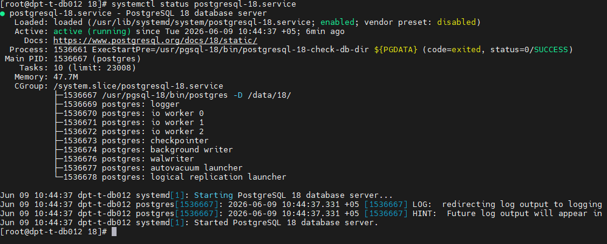
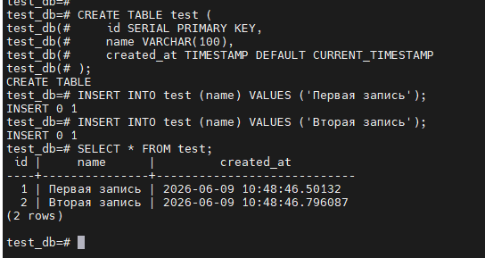
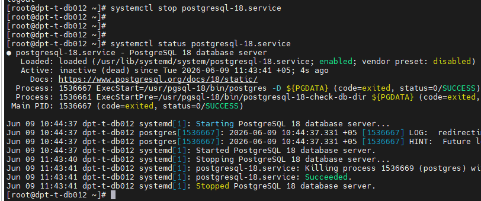
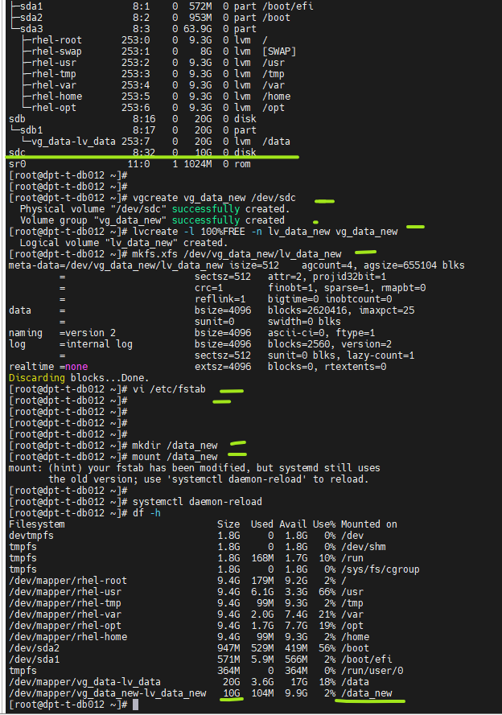
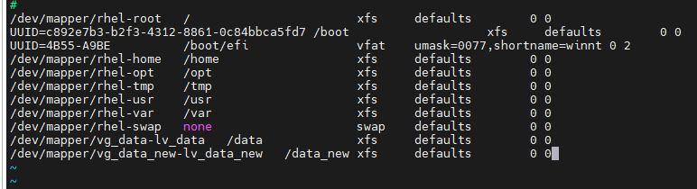
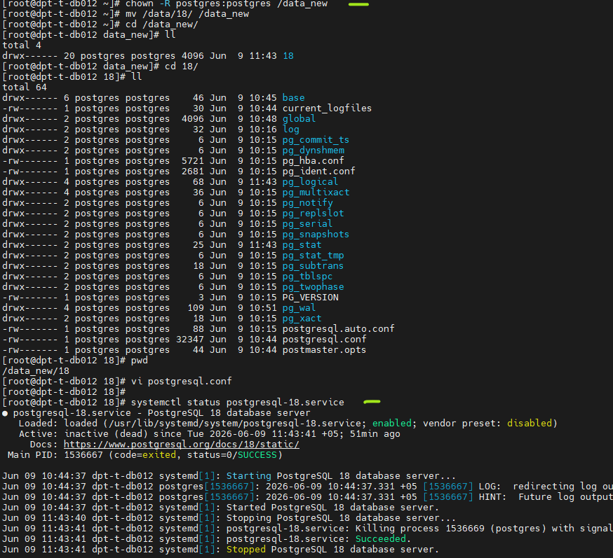
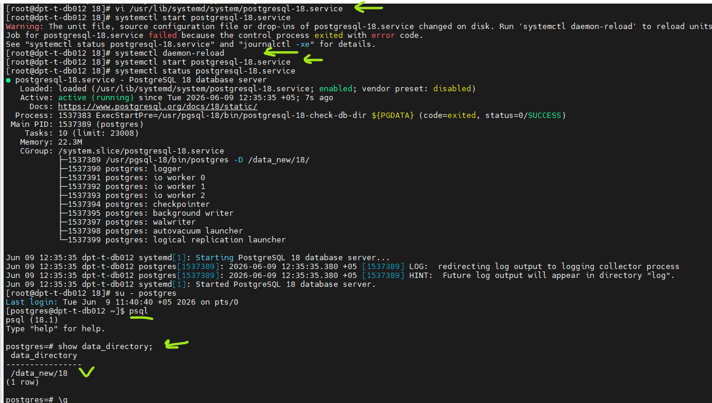
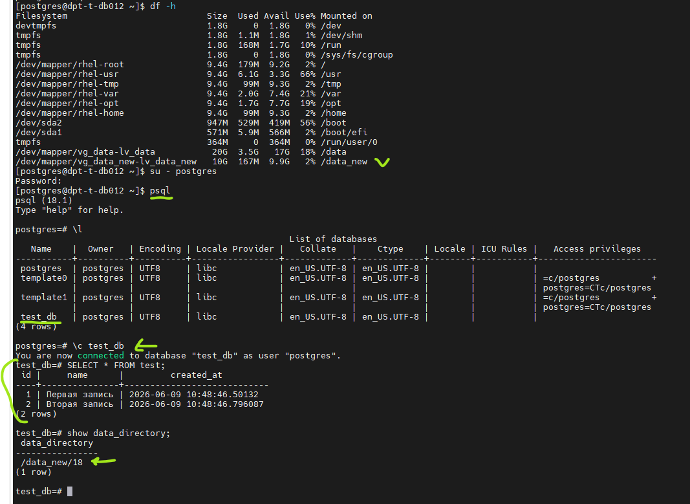

# Домашнее задание HW02
## Задание
### 1. Созната тестовая ВМ
### 2. Установлены пакеты Postgresql-18
### 3. Создан service  postgresql-18 и проверен запуск кластера.
### 4. Создана тестовая БД и создана тестовая таблица, добавлено несколько строк.
### 5. Остановка кластера.
### 6. Добавлен дополнительный диск на 10 GB
### 7. Размечен новый диск.
### 8. Добавлен в fstab
### 9. Добавлены права.
### 10. Перенос каталога из /data/18 в /data_new/18
### 11. Правка сервиса (смена пути PGDATA) перезагрузка демона.
### 12. Правка postgresql.conf и postgresql-18.service 
### 13. Запуск кластера.
### 14. Проверка.

____________________________

# 1. ВМ создана.

# 2. Установлена версия postgresql-18

# 3. Создан service  postgresql-18 и проверен запуск кластера.

Создан сервис и проверен запуск кластера.

# 4. Создана тестовая БД и создана тестовая таблица, добавлено несколько строк.

Команды:
create database test_db;
CREATE TABLE test (
    id SERIAL PRIMARY KEY,
    name VARCHAR(100),
    created_at TIMESTAMP DEFAULT CURRENT_TIMESTAMP
);
INSERT INTO test (name) VALUES ('Первая запись');
INSERT INTO test (name) VALUES ('Вторая запись');

с проверкой 
SELECT * FROM test;

# 5. Остановка кластера.

systemctl stop postgresql-18.service

# 6 -7 - 8. Добавлен дополнительный диск на 10 GB и размечаем его.

Добавлен новый диск. Разметка диска и монтирование раздела.

Команды:
vgcreate vg_data_new /dev/sdc                         
	lvcreate -l 100%FREE -n lv_data_new vg_data_new 
	mkfs.xfs /dev/vg_data_new/lv_data_new 
	mkdir /data_new
	mount /data_new

Добавлено в fstab

Команды:
vi /etc/fstab

/dev/mapper/vg_data_new-lv_data_new /data_new xfs defaults        0 0

# 9. Добавлены права.

Команды:
chown -R postgres:postgres /data_new/18/
chmod -R 750 /data_new/18/

# 10. Перенос каталога из /data/18 в /data_new/18

mv /data/18 /data_new

# 11. Правка сервиса (смена пути PGDATA) перезагрузка демона.

Команды:
vi /usr/lib/systemd/system/postgresql-18.service

Правим путь # Location of database directory
Environment=PGDATA=/data_new/18/
systemctl daemon-reload

# 13 - 14  Запуск кластера. Проверка.
  

